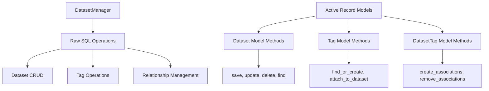

# Active Record Models Design

## Overview

This design document outlines the refactoring of database access patterns from `DatasetManager` into an Active Record pattern within the database models. The goal is to move database-specific operations closer to the data models while maintaining the centralized business logic in `DatasetManager`.

Currently, `DatasetManager` contains extensive raw SQL operations using Diesel's query builder. This design proposes extracting these patterns into Active Record-style methods on the model structs themselves, improving code organization and reusability.

## Current Architecture Analysis

### Database Access Patterns in DatasetManager

The current `DatasetManager` performs the following database operations:

1. **Dataset CRUD Operations**
   - Creating datasets with transaction handling
   - Finding datasets by ID or UUID
   - Listing datasets with tag relationships
   - Updating dataset metadata
   - Deleting datasets

2. **Tag Management**
   - Adding tags with batch operations
   - Removing tags with relationship cleanup
   - Tag-dataset association management

3. **Status Management**
   - Updating dataset status during lifecycle transitions
   - Managing pending write operations

4. **Complex Queries**
   - Loading datasets with associated tags using joins
   - Batch operations with transaction safety
   - Grouped queries for dataset-tag relationships

### Identified Patterns for Extraction



## Active Record Model Design

### Database Layer Error Type

```rust
/// Database-specific errors that can occur during model operations
#[derive(Debug, thiserror::Error)]
pub enum DatabaseError {
    #[error("Record not found: {entity} with {field}={value}")]
    NotFound {
        entity: &'static str,
        field: &'static str,
        value: String,
    },

    #[error("Database constraint violation: {message}")]
    ConstraintViolation { message: String },

    #[error("Transaction failed: {source}")]
    TransactionFailed {
        #[from]
        source: diesel::result::Error,
    },

    #[error("Connection pool error: {source}")]
    ConnectionPool {
        #[from]
        source: anyhow::Error,
    },

    #[error("Serialization error: {message}")]
    Serialization { message: String },

    #[error("Database operation failed: {operation} - {source}")]
    OperationFailed {
        operation: &'static str,
        #[source]
        source: diesel::result::Error,
    },
}

impl From<DatabaseError> for DatasetManagerError {
    fn from(err: DatabaseError) -> Self {
        match err {
            DatabaseError::NotFound { entity, field, value } => {
                DatasetManagerError::NotFound {
                    id: format!("{entity} {field}={value}")
                }
            }
            _ => DatasetManagerError::Database {
                source: anyhow::Error::new(err)
            }
        }
    }
}
```

### Core Model Enhancements

#### Dataset Model Extensions

```rust
impl Dataset {
    // Class methods (static) - simple database operations
    pub async fn find_by_id(app: &AppHandle, id: i32) -> Result<Option<Self>, DatabaseError> {
        app.database()
            .interact(move |conn| {
                use crate::database::schema::datasets::dsl::*;

                datasets
                    .find(id)
                    .select(Self::as_select())
                    .first(conn)
                    .optional()
                    .map_err(|e| DatabaseError::OperationFailed {
                        operation: "find_by_id",
                        source: e,
                    })
            })
            .await
            .map_err(DatabaseError::ConnectionPool)?
    }

    pub async fn find_by_uuid(app: &AppHandle, uuid: Uuid) -> Result<Option<Self>, DatabaseError> {
        app.database()
            .interact(move |conn| {
                use crate::database::schema::datasets::dsl::*;

                datasets
                    .filter(uuid.eq(SimpleUuid(uuid)))
                    .select(Self::as_select())
                    .first(conn)
                    .optional()
                    .map_err(|e| DatabaseError::OperationFailed {
                        operation: "find_by_uuid",
                        source: e,
                    })
            })
            .await
            .map_err(DatabaseError::ConnectionPool)?
    }

    pub async fn list_all_ordered(app: &AppHandle) -> Result<Vec<Self>, DatabaseError> {
        app.database()
            .interact(|conn| {
                use crate::database::schema::datasets::dsl::*;

                datasets
                    .order(id.desc())
                    .select(Self::as_select())
                    .load(conn)
                    .map_err(|e| DatabaseError::OperationFailed {
                        operation: "list_all_ordered",
                        source: e,
                    })
            })
            .await
            .map_err(DatabaseError::ConnectionPool)?
    }

    // Instance methods - direct database operations
    pub async fn update_status(&mut self, app: &AppHandle, new_status: DatasetStatus) -> Result<(), DatabaseError> {
        let dataset_id = self.id;
        app.database()
            .interact(move |conn| {
                use crate::database::schema::datasets::dsl::*;

                diesel::update(datasets.find(dataset_id))
                    .set(status.eq(new_status))
                    .execute(conn)
                    .map_err(|e| DatabaseError::OperationFailed {
                        operation: "update_status",
                        source: e,
                    })
            })
            .await
            .map_err(DatabaseError::ConnectionPool)??
            .map(|_| {
                self.status = new_status;
            })
    }

    pub async fn update_metadata(&mut self, app: &AppHandle, update: &DatasetUpdateRequest) -> Result<(), DatabaseError> {
        let dataset_id = self.id;
        let db_update = crate::database::DatasetUpdate {
            name: update.name.clone(),
            description: update.description.clone(),
            favorite: update.favorite,
            status: None,
        };

        app.database()
            .interact(move |conn| {
                use crate::database::schema::datasets::dsl::*;

                diesel::update(datasets.find(dataset_id))
                    .set(&db_update)
                    .execute(conn)
                    .map_err(|e| DatabaseError::OperationFailed {
                        operation: "update_metadata",
                        source: e,
                    })
            })
            .await
            .map_err(DatabaseError::ConnectionPool)??
            .map(|_| {
                if let Some(name) = &update.name {
                    self.name = name.clone();
                }
                if let Some(description) = &update.description {
                    self.description = description.clone();
                }
                if let Some(favorite) = update.favorite {
                    self.favorite = favorite;
                }
            })
    }

    pub async fn delete_from_db(app: &AppHandle, dataset_id: i32) -> Result<(), DatabaseError> {
        app.database()
            .interact(move |conn| {
                use crate::database::schema::datasets::dsl::*;

                diesel::delete(datasets.find(dataset_id))
                    .execute(conn)
                    .map_err(|e| DatabaseError::OperationFailed {
                        operation: "delete_from_db",
                        source: e,
                    })
            })
            .await
            .map_err(DatabaseError::ConnectionPool)??
            .map(|_| ())
    }

    // Relationship methods
    pub async fn load_tags(&self, app: &AppHandle) -> Result<Vec<Tag>, DatabaseError> {
        let dataset_id = self.id;
        app.database()
            .interact(move |conn| {
                DatasetTag::belonging_to(&Dataset { id: dataset_id, ..Default::default() })
                    .inner_join(crate::database::schema::tags::table)
                    .select(Tag::as_select())
                    .load(conn)
                    .map_err(|e| DatabaseError::OperationFailed {
                        operation: "load_tags",
                        source: e,
                    })
            })
            .await
            .map_err(DatabaseError::ConnectionPool)?
    }

    // Utility methods
    pub fn to_record_with_tags(self, tags: Vec<Tag>) -> DatasetRecord {
        DatasetRecord::from_database_models(self, tags)
    }

    pub fn dataset_path(&self, app: &AppHandle) -> PathBuf {
        app.root().paths().dataset_path_from_uuid(self.uuid.0)
    }

    pub fn metadata_path(&self, app: &AppHandle) -> PathBuf {
        self.dataset_path(app).join(crate::dataset_manager::METADATA_NAME)
    }
}
```

#### Tag Model Extensions

```rust
impl Tag {
    // Class methods - simple database operations
    pub async fn find_by_name(app: &AppHandle, name: &str) -> Result<Option<Self>, DatabaseError> {
        let name = name.to_string();
        app.database()
            .interact(move |conn| {
                use crate::database::schema::tags::dsl::*;

                tags
                    .filter(name.eq(&name))
                    .select(Self::as_select())
                    .first(conn)
                    .optional()
                    .map_err(|e| DatabaseError::OperationFailed {
                        operation: "find_by_name",
                        source: e,
                    })
            })
            .await
            .map_err(DatabaseError::ConnectionPool)?
    }

    pub async fn find_or_create_batch(app: &AppHandle, names: Vec<String>) -> Result<Vec<Self>, DatabaseError> {
        app.database()
            .interact(move |conn| {
                conn.immediate_transaction(|conn| {
                    use crate::database::schema::tags::dsl::*;

                    // Insert new tags (ignore duplicates)
                    let new_tags: Vec<_> = names.iter().map(|name| NewTag { name }).collect();
                    diesel::insert_or_ignore_into(tags)
                        .values(new_tags)
                        .execute(conn)
                        .map_err(|e| DatabaseError::OperationFailed {
                            operation: "insert_tags",
                            source: e,
                        })?;

                    // Return all requested tags
                    tags
                        .filter(name.eq_any(&names))
                        .select(Self::as_select())
                        .load(conn)
                        .map_err(|e| DatabaseError::OperationFailed {
                            operation: "load_created_tags",
                            source: e,
                        })
                })
            })
            .await
            .map_err(DatabaseError::ConnectionPool)?
    }

    pub async fn create_new(app: &AppHandle, tag_name: &str) -> Result<Self, DatabaseError> {
        let name = tag_name.to_string();
        app.database()
            .interact(move |conn| {
                use crate::database::schema::tags::dsl::*;

                let new_tag = NewTag { name: &name };
                diesel::insert_into(tags)
                    .values(new_tag)
                    .returning(Self::as_returning())
                    .get_result(conn)
                    .map_err(|e| DatabaseError::OperationFailed {
                        operation: "create_new",
                        source: e,
                    })
            })
            .await
            .map_err(DatabaseError::ConnectionPool)?
    }

    // Relationship methods
    pub async fn datasets(&self, app: &AppHandle) -> Result<Vec<Dataset>, DatabaseError> {
        let tag_id = self.id;
        app.database()
            .interact(move |conn| {
                use crate::database::schema::{datasets, datasets_tags};

                datasets_tags::table
                    .filter(datasets_tags::tag_id.eq(tag_id))
                    .inner_join(datasets::table)
                    .select(Dataset::as_select())
                    .load(conn)
                    .map_err(|e| DatabaseError::OperationFailed {
                        operation: "load_datasets",
                        source: e,
                    })
            })
            .await
            .map_err(DatabaseError::ConnectionPool)?
    }
}
```

#### DatasetTag Association Model

```rust
impl DatasetTag {
    // Class methods - simple association operations
    pub async fn create_associations(app: &AppHandle, dataset_id: i32, tag_ids: Vec<i32>) -> Result<Vec<Self>, DatabaseError> {
        app.database()
            .interact(move |conn| {
                use crate::database::schema::datasets_tags::dsl::*;

                let new_associations: Vec<_> = tag_ids
                    .into_iter()
                    .map(|tag_id| DatasetTag { dataset_id, tag_id })
                    .collect();

                diesel::insert_or_ignore_into(datasets_tags)
                    .values(&new_associations)
                    .returning(Self::as_returning())
                    .get_results(conn)
                    .map_err(|e| DatabaseError::OperationFailed {
                        operation: "create_associations",
                        source: e,
                    })
            })
            .await
            .map_err(DatabaseError::ConnectionPool)?
    }

    pub async fn remove_associations(app: &AppHandle, dataset_id: i32, tag_ids: Vec<i32>) -> Result<usize, DatabaseError> {
        app.database()
            .interact(move |conn| {
                use crate::database::schema::datasets_tags::dsl::*;

                diesel::delete(datasets_tags)
                    .filter(dataset_id.eq(dataset_id))
                    .filter(tag_id.eq_any(&tag_ids))
                    .execute(conn)
                    .map_err(|e| DatabaseError::OperationFailed {
                        operation: "remove_associations",
                        source: e,
                    })
            })
            .await
            .map_err(DatabaseError::ConnectionPool)?
    }

    pub async fn find_by_dataset(app: &AppHandle, dataset_id: i32) -> Result<Vec<Self>, DatabaseError> {
        app.database()
            .interact(move |conn| {
                use crate::database::schema::datasets_tags::dsl::*;

                datasets_tags
                    .filter(dataset_id.eq(dataset_id))
                    .select(Self::as_select())
                    .load(conn)
                    .map_err(|e| DatabaseError::OperationFailed {
                        operation: "find_by_dataset",
                        source: e,
                    })
            })
            .await
            .map_err(DatabaseError::ConnectionPool)?
    }
}
```

### Supporting Data Structures

#### Enhanced Request/Response Types

```rust
#[derive(Debug, Clone)]
pub struct DatasetWithTags {
    pub dataset: Dataset,
    pub tags: Vec<Tag>,
}

impl DatasetWithTags {
    pub fn to_record(self) -> DatasetRecord {
        DatasetRecord::from_database_models(self.dataset, self.tags)
    }
}

#[derive(Debug, Clone)]
pub struct DatasetUpdateRequest {
    pub name: Option<String>,
    pub description: Option<String>,
    pub favorite: Option<bool>,
}

#[derive(Debug, Clone)]
pub struct TagOperationResult {
    pub added: Vec<Tag>,
    pub existing: Vec<Tag>,
    pub errors: Vec<String>,
}
```

### Transaction Management in DatasetManager

Instead of complex trait abstractions, DatasetManager will directly use transactions when needed. This follows the KISS principle while maintaining data consistency.

```rust
// Example of direct transaction usage in DatasetManager
impl DatasetManager {
    pub async fn add_tags(&self, dataset_id: i32, tag_names: Vec<String>) -> Result<Vec<Tag>, DatasetManagerError> {
        // Use model methods for tag creation
        let tags = Tag::find_or_create_batch(&self.app, tag_names)
            .await
            .map_err(DatasetManagerError::from)?;

        // Use model method for association creation
        let tag_ids: Vec<i32> = tags.iter().map(|t| t.id).collect();
        DatasetTag::create_associations(&self.app, dataset_id, tag_ids)
            .await
            .map_err(DatasetManagerError::from)?;

        // Update metadata file (business logic remains in DatasetManager)
        let record = self.get_dataset(DatasetId::Id(dataset_id)).await?;
        let metadata_path = record.metadata.uuid
            .let metadata_path = self.app.root().paths()
                .dataset_path_from_uuid(record.metadata.uuid)
                .join(METADATA_NAME);
        record.metadata.save(&metadata_path)?;

        Ok(tags)
    }

    pub async fn create_db_record(
        &self,
        request: &CreateDatasetRequest,
        uuid: Uuid,
    ) -> Result<i32, DatasetManagerError> {
        // Direct transaction usage for complex operations
        let request = request.clone();
        let dataset_id = self
            .app
            .database()
            .interact(move |conn| {
                conn.immediate_transaction(|conn| {
                    // Create dataset record
                    let new_dataset = NewDataset {
                        uuid: SimpleUuid(uuid),
                        name: &request.name,
                        description: &request.description,
                        status: DatasetStatus::Pending,
                        index_columns: JsonValue(&request.index_columns),
                    };

                    let dataset = diesel::insert_into(schema::datasets::table)
                        .values(new_dataset)
                        .returning(database::Dataset::as_returning())
                        .get_result(conn)?;

                    // Handle tags if provided
                    if !request.tags.is_empty() {
                        // Create or find tags
                        let new_tags: Vec<_> = request.tags.iter().map(|name| NewTag { name }).collect();
                        diesel::insert_or_ignore_into(schema::tags::table)
                            .values(new_tags)
                            .execute(conn)?;

                        // Get tag IDs
                        let tag_ids = schema::tags::table
                            .filter(schema::tags::name.eq_any(&request.tags))
                            .select(schema::tags::id)
                            .load::<i32>(conn)?;

                        // Create associations
                        let dataset_tags: Vec<_> = tag_ids
                            .into_iter()
                            .map(|tag_id| DatasetTag {
                                dataset_id: dataset.id,
                                tag_id,
                            })
                            .collect();

                        diesel::insert_into(schema::datasets_tags::table)
                            .values(dataset_tags)
                            .execute(conn)?;
                    }

                    Ok(dataset.id)
                })
            })
            .await
            .map_err(|e| DatasetManagerError::Database { source: e })?;

        Ok(dataset_id)
    }
}
```

## Implementation Strategy

### Phase 1: Core Model Methods

1. **Dataset Basic Operations**
   - Implement `find_by_id`, `find_by_uuid`
   - Add `save`, `update_metadata`, `update_status`
   - Create `delete` with proper cleanup

2. **Tag Basic Operations**
   - Implement `find_by_name`, `find_or_create_batch`
   - Add `save`, `delete` methods

3. **Relationship Management**
   - Create `DatasetTag` association methods
   - Implement batch operations for tag associations

### Phase 2: Complex Query Methods

1. **Advanced Dataset Queries**
   - `list_all_with_tags` with efficient joining
   - Filter and search capabilities
   - Pagination support

2. **Tag Relationship Queries**
   - Tag usage statistics
   - Related datasets by tags

### Phase 3: DatasetManager Refactoring

1. **Replace Raw SQL Calls**
   - Refactor `get_dataset` to use `Dataset::find_by_id`
   - Update `list_datasets` to use `Dataset::list_all_with_tags`
   - Replace tag operations with model methods

2. **Simplify Business Logic**
   - Focus on orchestration and file system operations
   - Maintain event publishing and error handling
   - Keep write token management

### Example Refactored Methods

#### Before (DatasetManager)

```rust
pub async fn get_dataset(&self, id: DatasetId) -> Result<DatasetRecord, DatasetManagerError> {
    let (dataset, tags) = self
        .app
        .database()
        .interact(move |conn| {
            let dataset = match id {
                DatasetId::Id(dataset_id) => schema::datasets::table
                    .find(dataset_id)
                    .select(database::Dataset::as_select())
                    .first(conn)?,
                DatasetId::Uuid(uuid) => schema::datasets::table
                    .filter(schema::datasets::uuid.eq(SimpleUuid(uuid)))
                    .select(database::Dataset::as_select())
                    .first(conn)?,
            };

            let tags = database::DatasetTag::belonging_to(&dataset)
                .inner_join(schema::tags::table)
                .select(database::Tag::as_select())
                .load(conn)?;

            Ok((dataset, tags))
        })
        .await?;

    Ok(DatasetRecord::from_database_models(dataset, tags))
}
```

#### After (DatasetManager using Active Record methods)

```rust
pub async fn get_dataset(&self, id: DatasetId) -> Result<DatasetRecord, DatasetManagerError> {
    let dataset = match id {
        DatasetId::Id(dataset_id) => {
            Dataset::find_by_id(&self.app, dataset_id)
                .await
                .map_err(DatasetManagerError::from)?
                .ok_or(DatasetManagerError::NotFound {
                    id: dataset_id.to_string()
                })?
        }
        DatasetId::Uuid(uuid) => {
            Dataset::find_by_uuid(&self.app, uuid)
                .await
                .map_err(DatasetManagerError::from)?
                .ok_or(DatasetManagerError::NotFound {
                    id: uuid.to_string()
                })?
        }
    };

    let tags = dataset.load_tags(&self.app)
        .await
        .map_err(DatasetManagerError::from)?;

    Ok(dataset.to_record_with_tags(tags))
}
```

#### Complex Operations with Direct Transactions

```rust
// DatasetManager still handles complex business logic with transactions
pub async fn update_dataset_with_tags(
    &self,
    id: i32,
    update: DatasetUpdate,
    new_tags: Option<Vec<String>>,
) -> Result<DatasetRecord, DatasetManagerError> {
    // Use transaction for complex multi-table operations
    let app = self.app.clone();
    let result = app
        .database()
        .interact(move |conn| {
            conn.immediate_transaction(|conn| {
                // Update dataset metadata
                let db_update = database::DatasetUpdate {
                    name: update.name.clone(),
                    description: update.description.clone(),
                    favorite: update.favorite,
                    status: None,
                };

                diesel::update(schema::datasets::table.find(id))
                    .set(&db_update)
                    .execute(conn)?;

                // Handle tag updates if provided
                if let Some(tag_names) = new_tags {
                    // Remove all existing tags
                    diesel::delete(schema::datasets_tags::table)
                        .filter(schema::datasets_tags::dataset_id.eq(id))
                        .execute(conn)?;

                    if !tag_names.is_empty() {
                        // Create or find new tags
                        let new_tags: Vec<_> = tag_names.iter().map(|name| NewTag { name }).collect();
                        diesel::insert_or_ignore_into(schema::tags::table)
                            .values(new_tags)
                            .execute(conn)?;

                        // Get tag IDs and create associations
                        let tag_ids = schema::tags::table
                            .filter(schema::tags::name.eq_any(&tag_names))
                            .select(schema::tags::id)
                            .load::<i32>(conn)?;

                        let dataset_tags: Vec<_> = tag_ids
                            .into_iter()
                            .map(|tag_id| DatasetTag { dataset_id: id, tag_id })
                            .collect();

                        diesel::insert_into(schema::datasets_tags::table)
                            .values(dataset_tags)
                            .execute(conn)?;
                    }
                }

                Ok(())
            })
        })
        .await
        .map_err(|e| DatasetManagerError::Database { source: e })?;

    // Update metadata file (business logic)
    let record = self.get_dataset(DatasetId::Id(id)).await?;
    let metadata_path = self.app.root().paths()
        .dataset_path_from_uuid(record.metadata.uuid)
        .join(METADATA_NAME);
    record.metadata.save(&metadata_path)?;

    Ok(record)
}
```

### Integration Tests

```rust
#[tokio::test]
async fn test_dataset_manager_with_active_record() {
    let app = setup_test_app().await;
    let manager = DatasetManager::new(app.clone());

    // Test create_dataset still works
    let token = manager.create_dataset(CreateDatasetRequest {
        name: "test".to_string(),
        description: "test desc".to_string(),
        tags: vec!["tag1".to_string()],
        index_columns: vec![],
    }).await.unwrap();

    // Verify using Active Record methods
    let datasets = Dataset::list_all_with_tags(&app).await.unwrap();
    assert_eq!(datasets.len(), 1);
    assert_eq!(datasets[0].tags.len(), 1);
}
```

## Performance Considerations

### Query Optimization with Simple Methods

1. **Single Responsibility Methods**
   - Each model method handles one specific database operation
   - Avoid N+1 problems by providing explicit relationship loading methods
   - Use efficient joins in `load_tags` and similar methods

2. **Batch Operations**
   - `Tag::find_or_create_batch` handles multiple tags in single transaction
   - `DatasetTag::create_associations` for bulk association creation
   - Use `insert_or_ignore` for idempotent operations

3. **Connection Pool Management**
   - Maintain existing pool configuration
   - Keep database interactions short and focused
   - Ensure proper connection release after operations

### Memory Usage

1. **Selective Loading**
   - Provide separate methods for loading datasets with/without tags
   - Use `Optional` returns to handle not-found cases efficiently
   - Avoid loading unnecessary data in simple operations

2. **Error Handling Efficiency**
   - `DatabaseError` provides specific error types without heavyweight context
   - Efficient conversion between error types
   - Minimal allocation in error paths

### Database Operation Patterns

1. **Simple Operations Use Model Methods**
   ```rust
   // Efficient single-record operations
   let dataset = Dataset::find_by_id(&app, id).await?;
   dataset.update_status(&app, DatasetStatus::Completed).await?;
   ```

2. **Complex Operations Use Direct Transactions**
   ```rust
   // Multi-table operations stay in DatasetManager
   app.database().interact(|conn| {
       conn.immediate_transaction(|conn| {
           // Multiple related operations
       })
   }).await?;
   ```

3. **Relationship Loading Optimization**
   ```rust
   // Efficient tag loading with single query
   let tags = dataset.load_tags(&app).await?;

   // Batch tag creation with single transaction
   let tags = Tag::find_or_create_batch(&app, tag_names).await?;
   ```

## Migration Plan

### Phase 1: Database Error Type and Basic Model Methods

1. **Add DatabaseError to database/mod.rs**
   - Create comprehensive error type with proper error conversion
   - Implement conversion to DatasetManagerError

2. **Implement Basic Dataset Methods**
   - Add `find_by_id`, `find_by_uuid`, `list_all_ordered`
   - Add `update_status`, `update_metadata`
   - Add `load_tags` method

3. **Implement Basic Tag Methods**
   - Add `find_by_name`, `find_or_create_batch`, `create_new`
   - Add `datasets` relationship method

4. **Implement DatasetTag Association Methods**
   - Add `create_associations`, `remove_associations`
   - Add `find_by_dataset` method

### Phase 2: DatasetManager Refactoring

1. **Replace Simple Operations**
   - Refactor `get_dataset` to use model methods
   - Update status management to use `Dataset::update_status`
   - Replace tag loading with `Dataset::load_tags`

2. **Keep Complex Operations with Direct Transactions**
   - Maintain `create_db_record` with transaction for dataset creation
   - Keep complex tag operations in DatasetManager with transactions
   - Preserve file system operations and metadata management

3. **Maintain Business Logic**
   - Keep event publishing in DatasetManager
   - Maintain write token management
   - Preserve metadata file synchronization

### Phase 3: Testing and Validation

1. **Add Comprehensive Tests**
   - Unit tests for all model methods
   - Error handling tests for DatabaseError
   - Transaction rollback tests

2. **Integration Testing**
   - Verify DatasetManager still works correctly
   - Test error propagation from models to manager
   - Performance testing to ensure no regressions

### Implementation Guidelines

1. **Error Handling**
   - Always convert DatabaseError to DatasetManagerError at boundaries
   - Provide meaningful error messages with context
   - Use proper error chaining for debugging

2. **Transaction Usage**
   - Use model methods for simple single-table operations
   - Use direct transactions in DatasetManager for complex multi-table operations
   - Keep transaction boundaries as small as possible

3. **Code Organization**
   - Keep database logic in models
   - Keep business logic in DatasetManager
   - Maintain clear separation between data access and business rules

### Example File Structure After Migration

```
src/database/
├── mod.rs           # DatabaseError definition and re-exports
├── models.rs        # Enhanced models with Active Record methods
├── schema.rs        # Diesel schema (unchanged)
└── types.rs         # Custom types (unchanged)

src/
├── dataset_manager.rs  # Simplified with model method usage
└── ...
```
