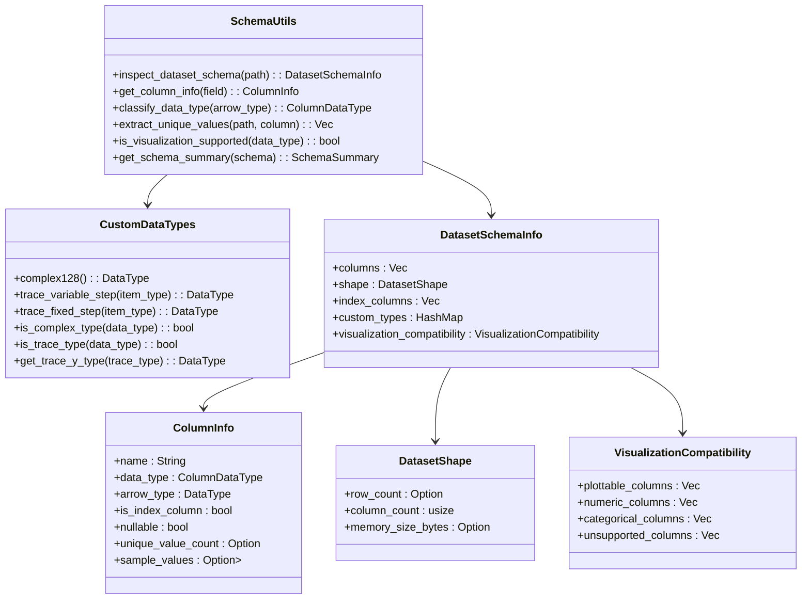
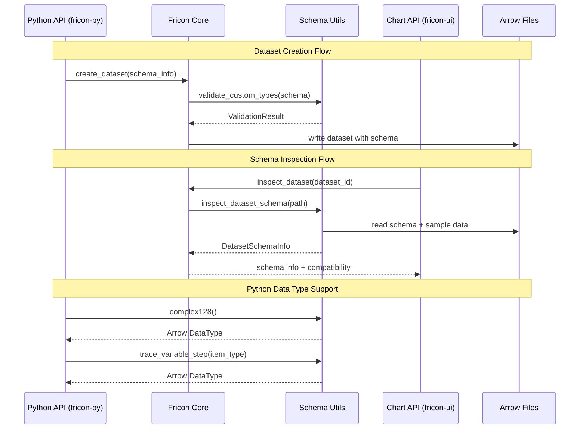

# Arrow Schema Utilities Design

## Overview

This design proposes the implementation of a centralized Arrow schema utility module in the `fricon` crate to consolidate dataset schema operations. Currently, custom Arrow datatypes (complex128, trace) are scattered across fricon-py, and schema inspection functionality is duplicated in fricon-ui's charting module. The goal is to create a unified schema utilities module that serves both writing/reading operations and visualization needs.

## Technology Stack & Dependencies

- **Core**: Rust with Apache Arrow
- **Schema Operations**: arrow-rs datatypes and schema APIs
- **Serialization**: serde for JSON schema export
- **Integration**: fricon-py (Python bindings), fricon-ui (Tauri desktop app)

## Architecture

### Schema Utilities Module Structure



### Integration with Existing Components



## Component Architecture

### Core Schema Utilities Module

#### Schema Inspection Engine
Provides comprehensive dataset schema analysis:

- **Arrow Schema Reading**: Direct reading from IPC files
- **Type Classification**: Categorizes Arrow types for visualization compatibility
- **Shape Analysis**: Extracts dataset dimensions and memory footprint
- **Sample Data Extraction**: Retrieves representative values for UI display

#### Custom Data Types Registry
Centralizes all custom Arrow data type definitions:

- **Complex Number Type**: Struct with real/imaginary Float64 fields
- **Trace Types**: Variable-step and fixed-step time series structures
- **Type Validation**: Ensures consistency across Python and Rust implementations
- **Schema Compatibility**: Verifies custom types work with Arrow format

#### Visualization Compatibility Analyzer
Determines which columns can be visualized:

- **Numeric Type Detection**: Identifies plottable numeric data
- **Categorical Analysis**: Finds columns suitable for grouping/filtering
- **Custom Type Support**: Handles complex numbers and traces in charts
- **Limitation Reporting**: Lists unsupported columns with reasons

### Data Models & Schema Representation

#### DatasetSchemaInfo
Primary schema information container:

```rust
pub struct DatasetSchemaInfo {
    pub columns: Vec<ColumnInfo>,
    pub shape: DatasetShape,
    pub index_columns: Vec<String>,
    pub custom_types: HashMap<String, CustomTypeInfo>,
    pub visualization_compatibility: VisualizationCompatibility,
}
```

#### ColumnInfo
Detailed column metadata:

```rust
pub struct ColumnInfo {
    pub name: String,
    pub data_type: ColumnDataType,
    pub arrow_type: DataType,
    pub is_index_column: bool,
    pub nullable: bool,
    pub unique_value_count: Option<usize>,
    pub sample_values: Option<Vec<ColumnValue>>,
}
```

#### Custom Type Information
Metadata for non-standard Arrow types:

```rust
pub struct CustomTypeInfo {
    pub type_name: String,
    pub underlying_structure: ArrowTypeStructure,
    pub visualization_support: CustomTypeVisualization,
    pub conversion_hints: ConversionHints,
}
```

### Schema Operations API

#### Core Functions
Essential schema inspection operations:

- `inspect_dataset_schema(path: &Path) -> Result<DatasetSchemaInfo>`
- `get_column_compatibility(column: &ColumnInfo) -> VisualizationCompatibility`
- `extract_shape_info(path: &Path) -> Result<DatasetShape>`
- `sample_column_values(path: &Path, column: &str, limit: usize) -> Result<Vec<ColumnValue>>`

#### Custom Type Operations
Centralized custom type management:

- `complex128() -> DataType`
- `trace_variable_step(item_type: DataType) -> DataType`
- `trace_fixed_step(item_type: DataType) -> DataType`
- `is_custom_type(data_type: &DataType) -> bool`
- `parse_custom_type(data_type: &DataType) -> Option<CustomTypeInfo>`

#### Validation & Compatibility
Schema validation and compatibility checking:

- `validate_schema_for_writing(schema: &Schema) -> Result<ValidationResult>`
- `check_visualization_compatibility(schema: &Schema) -> VisualizationCompatibility`
- `get_supported_chart_types(column: &ColumnInfo) -> Vec<ChartType>`

## Integration Strategy

### fricon-py Integration
Migrate custom type definitions from Python bindings:

- **Type Export**: Export complex128() and trace_() functions from schema_utils
- **Validation Integration**: Use centralized validation in DatasetWriter
- **Schema Inference**: Leverage unified type classification
- **Error Consistency**: Standardize schema-related error messages

### fricon-ui Integration
Replace duplicate chart schema logic:

- **Schema Reader**: Use DatasetSchemaInfo instead of custom ChartSchemaResponse
- **Type Classification**: Utilize centralized ColumnDataType classification
- **Compatibility Checking**: Leverage visualization_compatibility analysis
- **Performance**: Cache schema info to avoid repeated file reads

### API Consistency
Ensure consistent schema handling across all interfaces:

- **Unified Types**: Same DataType definitions across Python/Rust/UI
- **Standard Errors**: Consistent error types for schema validation failures
- **Documentation**: Centralized documentation for custom types and limitations

## Testing Strategy

### Unit Testing Framework
Comprehensive test coverage for schema utilities:

- **Custom Type Tests**: Validate complex128 and trace type generation
- **Schema Reading Tests**: Test Arrow file schema extraction
- **Compatibility Tests**: Verify visualization compatibility analysis
- **Edge Case Handling**: Test malformed schemas, empty datasets, large files

### Integration Testing
End-to-end testing across components:

- **Python API Tests**: Validate fricon-py custom type integration
- **UI Integration Tests**: Test chart module schema consumption
- **Performance Tests**: Benchmark schema reading on large datasets
- **Compatibility Tests**: Ensure backward compatibility with existing datasets

### Test Data Scenarios
Representative test datasets covering various schema patterns:

- **Basic Types**: Primitives, strings, lists
- **Custom Types**: Complex numbers, traces (both variants)
- **Mixed Schemas**: Combination of standard and custom types
- **Large Datasets**: Performance testing with substantial data volumes
- **Edge Cases**: Empty datasets, single-column datasets, nested structures
