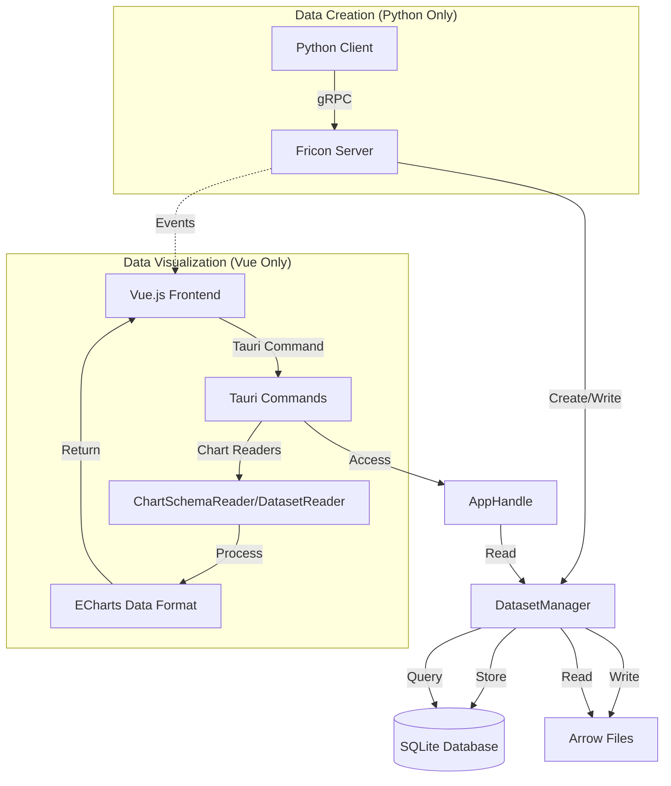
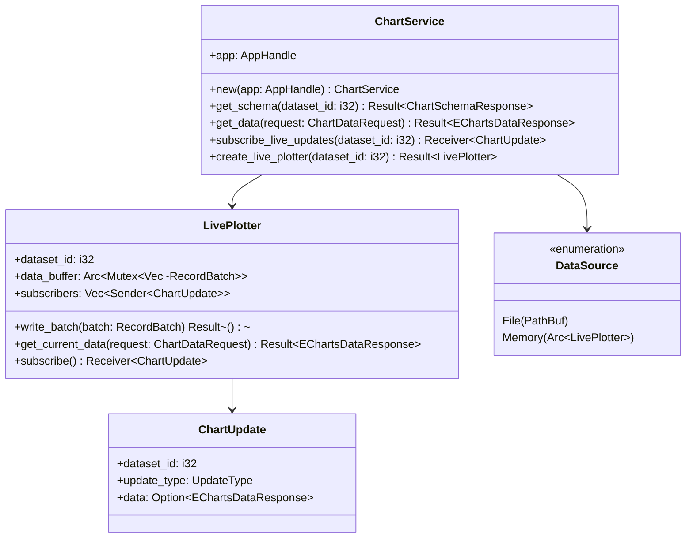
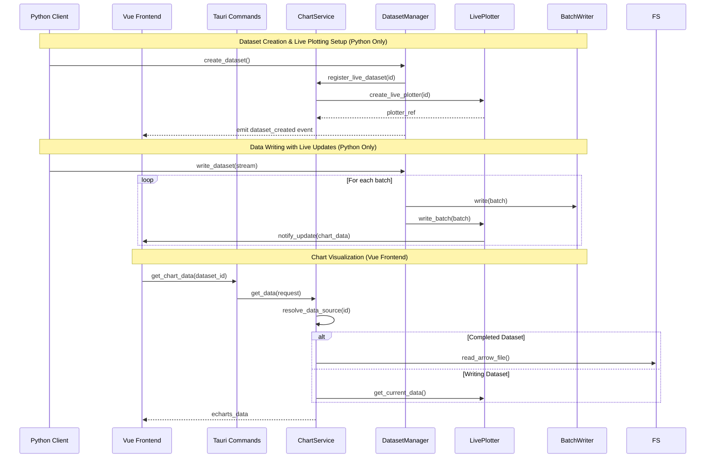

# Chart Service Integration Design

## Overview

This design document outlines the integration of chart visualization capabilities as a first-class service within the fricon application architecture. The chart service will provide unified visualization support for both completed datasets (file-based) and active datasets (memory-based with live updates), enabling real-time plotting capabilities.

> **Important Architecture Note**: In the fricon system, dataset creation and data writing operations are exclusively handled by Python clients through gRPC services. The Vue.js frontend provides visualization and monitoring capabilities only, including chart rendering and live update display. This separation ensures data integrity and maintains a clear boundary between data producers (Python) and data consumers (Vue UI).

## Current Architecture Analysis

### Existing Chart Implementation
- **ChartSchemaReader**: Reads Arrow schema for chart configuration
- **ChartDataReader**: Extracts chart data from completed Arrow files
- **ECharts Integration**: Frontend uses ECharts with optimized data formats
- **Tauri Commands**: `get_chart_schema` and `get_chart_data` for UI interaction
- **Dataset Monitoring**: Vue frontend listens for `dataset_created` events but cannot create datasets

### Current Vue Frontend Capabilities (Read-Only)
- **Dataset Listing**: `list_datasets` command to view existing datasets
- **Chart Visualization**: `get_chart_schema` and `get_chart_data` for visualization
- **Event Listening**: Monitors dataset creation events from Python clients
- **No Data Writing**: Vue frontend provides visualization only, no dataset creation or data writing

### Python Client Capabilities (Full Lifecycle)
- **Dataset Creation**: `manager.create()` with schema definition
- **Data Writing**: `writer.write()` for streaming data to datasets
- **Context Management**: Automatic resource cleanup and finalization
- **gRPC Communication**: Direct interaction with DataStorageService

### Current AppHandle Pattern
```rust
impl AppHandle {
    pub fn dataset_manager(&self) -> DatasetManager { ... }
}
```

### Existing Data Flow


## Design Goals

1. **Unified Chart Service**: Centralize all chart operations through AppHandle
2. **Dual Data Source Support**: Handle both file-based and memory-based datasets
3. **Real-time Updates**: Enable live plotting with data update notifications
4. **Minimal Refactoring**: Leverage existing BatchWriter architecture
5. **Clean API**: Maintain consistency with DatasetManager pattern

## Architecture Design

### Chart Service Structure



### AppHandle Integration

```rust
impl AppHandle {
    pub fn dataset_manager(&self) -> DatasetManager { ... }

    // New chart service accessor
    pub fn chart_service(&self) -> ChartService {
        ChartService::new(self.clone())
    }
}
```

### Data Source Abstraction

```rust
pub enum DataSource {
    /// Completed dataset - read from Arrow file
    File(PathBuf),
    /// Active dataset - read from memory buffer
    Memory(Arc<LivePlotter>),
}

impl ChartService {
    async fn resolve_data_source(&self, dataset_id: i32) -> Result<DataSource> {
        let dataset = self.app.dataset_manager()
            .get_dataset(DatasetId::Id(dataset_id)).await?;

        match dataset.metadata.status {
            DatasetStatus::Completed => {
                let path = self.app.root().paths()
                    .dataset_path_from_uuid(dataset.metadata.uuid)
                    .join("dataset.arrow");
                Ok(DataSource::File(path))
            }
            DatasetStatus::Writing => {
                let plotter = self.get_or_create_live_plotter(dataset_id).await?;
                Ok(DataSource::Memory(plotter))
            }
            _ => Err(ChartServiceError::DatasetNotReady { status: dataset.metadata.status })
        }
    }
}
```

## BatchWriter Integration Strategy

### Enhanced BatchWriter for Live Plotting

Rather than major refactoring, we'll extend the existing BatchWriter pattern:

```rust
pub struct LiveDatasetManager {
    dataset_id: i32,
    batch_writer: BatchWriter<BufWriter<File>>,
    live_plotter: Arc<LivePlotter>,
}

impl LiveDatasetManager {
    pub fn write_batch(&mut self, batch: RecordBatch) -> Result<()> {
        // Write to file (existing behavior)
        self.batch_writer.write(batch.clone())?;

        // Also update live buffer for real-time visualization
        self.live_plotter.write_batch(batch)?;

        Ok(())
    }
}
```

### Live Plotter Implementation

```rust
pub struct LivePlotter {
    dataset_id: i32,
    data_buffer: Arc<Mutex<Vec<RecordBatch>>>,
    subscribers: Arc<Mutex<Vec<broadcast::Sender<ChartUpdate>>>>,
    max_buffer_size: usize,
}

impl LivePlotter {
    const MAX_BUFFER_BATCHES: usize = 100;
    const NOTIFICATION_INTERVAL: Duration = Duration::from_millis(100);

    pub fn write_batch(&self, batch: RecordBatch) -> Result<()> {
        let mut buffer = self.data_buffer.lock().unwrap();
        buffer.push(batch);

        // Maintain rolling window
        if buffer.len() > Self::MAX_BUFFER_BATCHES {
            buffer.remove(0);
        }

        // Notify subscribers (throttled)
        self.notify_subscribers();

        Ok(())
    }

    pub fn get_current_data(&self, request: ChartDataRequest) -> Result<EChartsDataResponse> {
        let buffer = self.data_buffer.lock().unwrap();

        if buffer.is_empty() {
            return Ok(EChartsDataResponse {
                dataset: EChartsDataset { dimensions: vec![], source: vec![] },
                series: vec![]
            });
        }

        // Concatenate all batches and process like file-based data
        let combined_batch = arrow::compute::concat_batches(
            &buffer[0].schema(),
            buffer.iter()
        )?;

        ChartDataReader::process_batch_data(request, &combined_batch)
    }
}
```

## Service Registration and Lifecycle

### AppState Integration

```rust
pub struct AppState {
    root: WorkspaceRoot,
    database: Pool,
    tracker: TaskTracker,
    event_sender: broadcast::Sender<AppEvent>,
    chart_service: OnceCell<ChartService>,  // Lazy initialization
}

impl AppHandle {
    pub fn chart_service(&self) -> &ChartService {
        self.state.chart_service.get_or_init(|| ChartService::new(self.clone()))
    }
}
```

### Lifecycle Management



## API Design

### Chart Service Interface

```rust
pub struct ChartService {
    app: AppHandle,
    live_plotters: Arc<Mutex<HashMap<i32, Arc<LivePlotter>>>>,
}

impl ChartService {
    pub fn new(app: AppHandle) -> Self { ... }

    // Schema operations (unified for both data sources)
    pub async fn get_schema(&self, dataset_id: i32) -> Result<ChartSchemaResponse> { ... }

    // Data operations (auto-detects source)
    pub async fn get_data(&self, request: ChartDataRequest) -> Result<EChartsDataResponse> { ... }

    // Live plotting support
    pub async fn create_live_plotter(&self, dataset_id: i32) -> Result<Arc<LivePlotter>> { ... }
    pub fn subscribe_updates(&self, dataset_id: i32) -> Result<broadcast::Receiver<ChartUpdate>> { ... }

    // Lifecycle management
    pub async fn cleanup_completed_dataset(&self, dataset_id: i32) { ... }
}
```

### Tauri Command Updates

```rust
#[tauri::command]
async fn get_chart_schema(
    dataset_id: i32,
    state: State<'_, AppState>
) -> Result<ChartSchemaResponse, String> {
    state.app().chart_service()
        .get_schema(dataset_id)
        .await
        .map_err(|e| e.to_string())
}

#[tauri::command]
async fn get_chart_data(
    request: ChartDataRequest,
    state: State<'_, AppState>
) -> Result<EChartsDataResponse, String> {
    state.app().chart_service()
        .get_data(request)
        .await
        .map_err(|e| e.to_string())
}

#[tauri::command]
async fn subscribe_live_chart_updates(
    dataset_id: i32,
    window: tauri::Window,
    state: State<'_, AppState>
) -> Result<(), String> {
    let mut rx = state.app().chart_service()
        .subscribe_updates(dataset_id)
        .map_err(|e| e.to_string())?;

    tokio::spawn(async move {
        while let Ok(update) = rx.recv().await {
            let _ = window.emit("chart-update", &update);
        }
    });

    Ok(())
}
```

## Event System Integration

### Chart Update Events

```rust
#[derive(Debug, Clone, Serialize)]
pub struct ChartUpdate {
    pub dataset_id: i32,
    pub update_type: ChartUpdateType,
    pub data: Option<EChartsDataResponse>,
    pub timestamp: DateTime<Utc>,
}

#[derive(Debug, Clone, Serialize)]
pub enum ChartUpdateType {
    BatchAdded,
    DatasetCompleted,
    BufferFull,
}

// Integration with existing AppEvent system
pub enum AppEvent {
    DatasetCreated { /* existing fields */ },
    ChartUpdate(ChartUpdate),  // New event type
}
```

### Frontend Integration

```typescript
// Enhanced ChartViewer with live update support (Visualization Only)
export interface ChartViewer {
    setupLiveUpdates(datasetId: number): Promise<void>;
    handleChartUpdate(update: ChartUpdate): void;
    // Note: No dataset creation methods - handled by Python client
}

// Auto-refresh logic for datasets created by Python clients
async function setupLiveUpdates(datasetId: number) {
    await invoke('subscribe_live_chart_updates', { datasetId });

    listen<ChartUpdate>('chart-update', (event) => {
        if (event.payload.dataset_id === datasetId) {
            updateChartWithNewData(event.payload.data);
        }
    });
}

// Listen for new datasets created by Python clients
listen<DatasetCreatedEvent>('dataset-created', (event) => {
    // Update dataset list and optionally start live charting
    refreshDatasetList();
    if (autoChartingEnabled) {
        setupLiveUpdates(event.payload.id);
    }
});
```

## Memory Management Strategy

### Buffer Size Limits
- **Max Batches**: 100 RecordBatches per LivePlotter
- **Rolling Window**: Remove oldest batches when limit exceeded
- **Memory Threshold**: Monitor total memory usage across all plotters
- **Cleanup Policy**: Auto-remove plotters when dataset status becomes Completed

### Performance Optimizations
- **Lazy Loading**: Only create LivePlotter when first chart request arrives
- **Throttled Updates**: Limit notification frequency to 100ms intervals
- **Batch Consolidation**: Merge small batches before visualization processing
- **Schema Caching**: Cache Arrow schema info to avoid repeated file reads

## Testing Strategy

### Unit Tests
- ChartService data source resolution logic
- LivePlotter buffer management and rolling window
- Chart data format conversion for both file and memory sources
- Event notification throttling behavior

### Integration Tests
- End-to-end live plotting workflow
- Dataset lifecycle transitions (Writing → Completed → cleanup)
- Concurrent access to live plotters from multiple chart instances
- Memory usage under high-frequency data writing

### Performance Tests
- Chart data retrieval latency comparison (file vs memory)
- Memory growth patterns with long-running live datasets
- Frontend responsiveness with high-frequency chart updates

## Migration Strategy

### Phase 1: Service Foundation
1. Create ChartService structure with AppHandle integration
2. Implement data source abstraction layer
3. Migrate existing chart commands to use ChartService
4. Maintain backward compatibility with current API

### Phase 2: Live Plotting Core
1. Implement LivePlotter with basic buffer management
2. Integrate with BatchWriter in DatasetManager
3. Add chart update event system
4. Create basic Tauri commands for live subscriptions

### Phase 3: Frontend Visualization Enhancements
1. Enhance ChartViewer.vue with live update support for datasets created by Python clients
2. Add real-time chart refresh logic for ongoing data streams
3. Implement visual indicators for dataset status (Writing/Completed)
4. Add user controls for live plotting on/off for existing datasets
5. **Note**: No dataset creation UI needed - Python client handles all data operations

### Phase 4: Optimization & Polish
1. Implement advanced memory management
2. Add performance monitoring and metrics
3. Optimize chart data processing pipelines
4. Add comprehensive error handling and recovery
