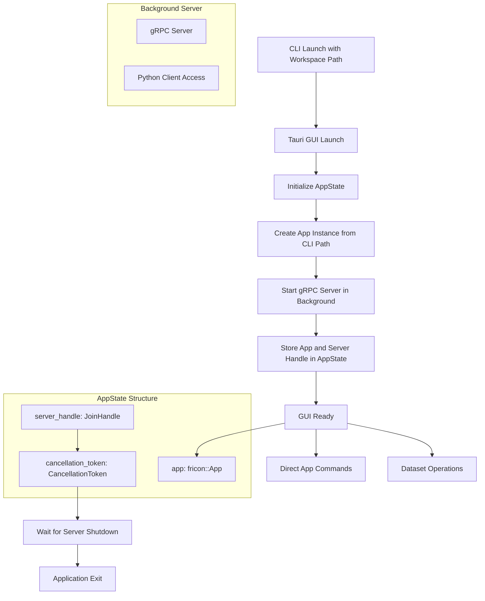
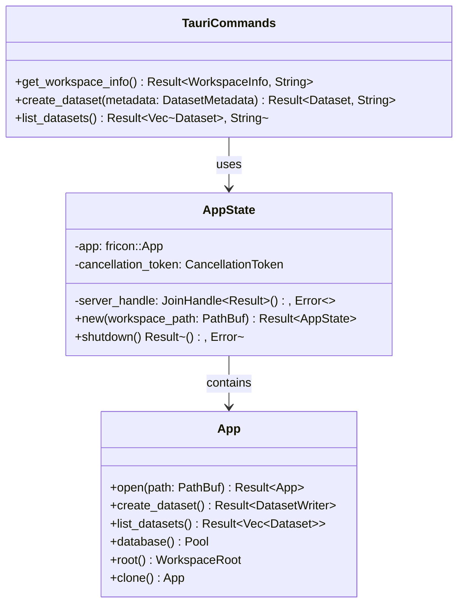
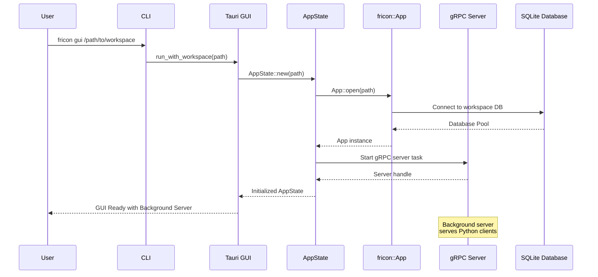
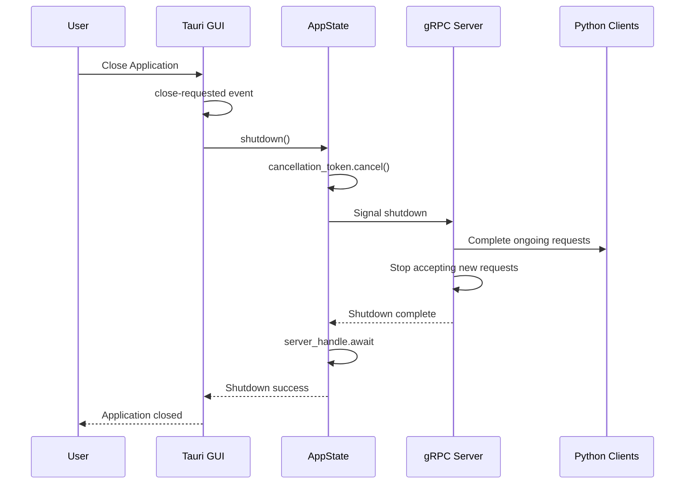
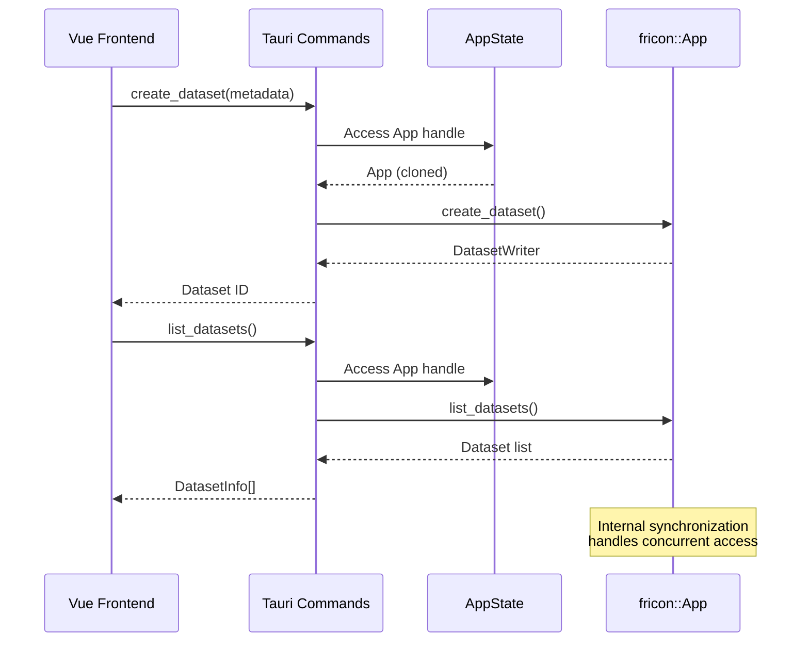

# CLI-GUI Integration Design

## Overview

This design document outlines the integration of CLI serve functionality with the GUI application, eliminating the need for separate CLI server processes. The integration will allow the GUI to manage workspace paths and run the fricon App in the background as part of the Tauri application state, making it accessible through Tauri commands.

## Current Architecture Analysis

### Existing Components

**CLI Command Structure (fricon-py)**
- `Commands::Serve { path }` - Starts standalone server via `fricon::run_server()`
- `Commands::Gui` - Launches Tauri GUI via `fricon_ui::run()`
- Separate processes for server and GUI

**Current GUI State (fricon-ui)**
- `AppState { client: Mutex<Option<fricon::Client>> }`
- Client connects to external server via IPC
- Commands: `select_workspace`, `get_connection_status`
- GUI provides workspace selection dialog on startup

**Core App Structure (fricon)**
- `App` struct manages workspace and database
- `App::run()` starts gRPC server with IPC
- `App::open(path)` creates App instance from workspace

## Architecture Design

### App Handle Design

**Cheaply Cloneable Handle**
- `fricon::App` implements `Clone` for O(1) cloning cost
- Multiple handles can access the same underlying workspace concurrently
- Internal synchronization ensures thread-safe operations
- No external locking required in application code

**Internal Synchronization Strategy**
- Database connection pool manages concurrent database access
- File system operations coordinated internally
- Atomic operations for metadata updates
- Lock-free data structures where possible

### Integrated Application Model



### Component Integration Strategy

**Enhanced AppState Structure**
```rust
use tokio_util::sync::CancellationToken;
use tokio::task::JoinHandle;

struct AppState {
    app: fricon::App,
    server_handle: JoinHandle<Result<(), anyhow::Error>>,
    cancellation_token: CancellationToken,
}

impl AppState {
    async fn new(workspace_path: PathBuf) -> Result<Self, anyhow::Error> {
        let app = fricon::App::open(&workspace_path).await?;
        let cancellation_token = CancellationToken::new();

        // Start gRPC server in background
        let server_app = app.clone();
        let server_token = cancellation_token.clone();
        let server_handle = tokio::spawn(async move {
            fricon::server::run_with_app_and_cancellation(server_app, server_token).await
        });

        Ok(Self {
            app,
            server_handle,
            cancellation_token,
        })
    }

    async fn shutdown(self) -> Result<(), anyhow::Error> {
        // Signal server to shutdown
        self.cancellation_token.cancel();

        // Wait for server to finish gracefully
        self.server_handle.await??
    }
}
```

**Unified Command Architecture**


## Implementation Design

### Tauri Application Initialization

**New GUI Entry Point with gRPC Server**
```rust
// In fricon-ui/src/lib.rs
use tauri::{Manager, AppHandle};
use tokio_util::sync::CancellationToken;

pub async fn run_with_workspace(workspace_path: PathBuf) -> Result<()> {
    let app_state = AppState::new(workspace_path).await
        .map_err(|e| format!("Failed to initialize workspace: {}", e))?;

    tauri::Builder::default()
        .plugin(tauri_plugin_opener::init())
        .invoke_handler(commands::invoke_handler())
        .manage(app_state)
        .setup(|app| {
            // Register shutdown handler
            let app_handle = app.handle().clone();
            app.listen_global("tauri://close-requested", move |_| {
                let app_handle = app_handle.clone();
                tauri::async_runtime::spawn(async move {
                    if let Ok(state) = app_handle.try_state::<AppState>() {
                        let state = state.inner().clone();
                        if let Err(e) = state.shutdown().await {
                            eprintln!("Error during shutdown: {}", e);
                        }
                    }
                });
            });
            Ok(())
        })
        .run(tauri::generate_context!())
        .expect("error while running tauri application");

    Ok(())
}

// Legacy function for backward compatibility
pub fn run() {
    eprintln!("Error: GUI requires workspace path. Use CLI: fricon gui <workspace_path>");
    std::process::exit(1);
}
```

### Enhanced AppState Management

**State Structure**
- `app: fricon::App` - Cheaply cloneable App handle with internal synchronization
- `server_handle: JoinHandle<Result<(), anyhow::Error>>` - Background gRPC server task
- `cancellation_token: CancellationToken` - Graceful shutdown coordination
- App designed for concurrent access without external locking
- App contains workspace path internally, no need for separate storage
- Background gRPC server serves Python client requests
- Remove dependency on external server process
- Remove workspace selection UI components

**State Lifecycle**
1. CLI provides workspace path as argument
2. Application startup with pre-initialized App instance
3. gRPC server starts in background for Python client access
4. App immediately available for concurrent direct access
5. App provides all functionality without IPC overhead
6. Internal synchronization handled by App implementation
7. Graceful shutdown cancels server and waits for completion

### Modified Tauri Commands

**Server Status Commands**
```rust
#[tauri::command]
async fn get_server_status(state: State<'_, AppState>) -> Result<ServerStatus, String> {
    Ok(ServerStatus {
        is_running: !state.server_handle.is_finished(),
        ipc_path: state.app.root().paths().ipc_file().to_string_lossy().to_string(),
    })
}

#[tauri::command]
async fn shutdown_server(state: State<'_, AppState>) -> Result<(), String> {
    state.cancellation_token.cancel();
    Ok(())
}
```

**Workspace Status Commands**
```rust
#[tauri::command]
async fn get_workspace_info(state: State<'_, AppState>) -> Result<WorkspaceInfo, String> {
    let workspace_path = state.app.root().path();

    Ok(WorkspaceInfo {
        path: workspace_path.to_string_lossy().to_string(),
        is_ready: true,
    })
}
```

**Dataset Operation Commands**
```rust
#[tauri::command]
async fn create_dataset(
    state: State<'_, AppState>,
    name: String,
    description: String,
    tags: Vec<String>,
    index_columns: Vec<String>
) -> Result<i32, String> {
    let writer = state.app.create_dataset(name, description, tags, index_columns)
        .await.map_err(|e| e.to_string())?;

    Ok(writer.id())
}

#[tauri::command]
async fn list_datasets(state: State<'_, AppState>) -> Result<Vec<DatasetInfo>, String> {
    let datasets = state.app.list_datasets().await
        .map_err(|e| e.to_string())?;

    let dataset_info: Vec<DatasetInfo> = datasets.into_iter()
        .map(|(dataset, tags)| DatasetInfo {
            id: dataset.id,
            name: dataset.name,
            description: dataset.description,
            tags: tags.into_iter().map(|t| t.name).collect(),
            created_at: dataset.created_at,
        })
        .collect();

    Ok(dataset_info)
}
```

### Data Transfer Objects

**Serializable Types for Frontend**
```rust
#[derive(Serialize)]
struct DatasetInfo {
    id: i32,
    name: String,
    description: String,
    tags: Vec<String>,
    created_at: chrono::DateTime<chrono::Utc>,
}

#[derive(Serialize)]
struct WorkspaceInfo {
    path: String,
    is_ready: bool,
}

#[derive(Serialize)]
struct ServerStatus {
    is_running: bool,
    ipc_path: String,
}
```

### CLI Integration Strategy

### CLI Integration Strategy

**Core App Server Modifications**
```rust
// In fricon/src/server.rs
use tokio_util::sync::CancellationToken;

pub async fn run_with_app_and_cancellation(
    app: App,
    cancellation_token: CancellationToken
) -> Result<()> {
    let ipc_file = app.root().paths().ipc_file();
    let tracker = TaskTracker::new();
    let storage = Storage::new(app, tracker.clone());
    let service = DataStorageServiceServer::new(storage);
    let listener = ipc::listen(ipc_file)?;

    Server::builder()
        .add_service(service)
        .add_service(FriconServiceServer::new(Fricon))
        .serve_with_incoming_shutdown(
            listener,
            async {
                cancellation_token.cancelled().await;
                info!("Received shutdown signal");
            }
        )
        .await?;

    info!("Server shutdown complete");
    tracker.close();
    tracker.wait().await;
    Ok(())
}

// Keep existing function for standalone server
pub async fn run_with_app(app: App) -> Result<()> {
    let cancellation_token = CancellationToken::new();

    tokio::select! {
        result = run_with_app_and_cancellation(app, cancellation_token.clone()) => result,
        _ = signal::ctrl_c() => {
            cancellation_token.cancel();
            Ok(())
        }
    }
}
```

**Updated CLI Structure**
```rust
#[derive(Debug, Subcommand)]
pub enum Commands {
    /// Initialize working directory
    Init { path: PathBuf },
    /// Start GUI with workspace
    Gui {
        /// Workspace path to open
        path: PathBuf
    },
}

pub async fn main(cli: Cli) -> Result<()> {
    tracing_subscriber::fmt::init();
    match cli.command {
        Commands::Init { path } => {
            let path = path::absolute(path)?;
            fricon::init_workspace(path).await?;
        }
        Commands::Gui { path } => {
            let path = fs::canonicalize(path)?;
            fricon_ui::run_with_workspace(path).await?;
        }
    }
    Ok(())
}
```

## Data Flow Architecture

### Application Initialization Flow



### Graceful Shutdown Flow





## Security and Performance Considerations

### Performance Improvements
- Direct function calls for GUI operations instead of gRPC overhead
- Background gRPC server serves Python clients concurrently
- No serialization/deserialization for internal GUI operations
- Reduced latency for GUI database operations
- Single process hosts both GUI and server
- No mutex contention - App handles internal synchronization
- Cheap cloning allows concurrent access without blocking
- Graceful shutdown prevents data corruption
- Automatic cleanup on application exit

### Testing Strategy

### Unit Testing
- AppState initialization with workspace path and server startup
- Command error handling for invalid workspace paths
- App handle cloning and concurrent access
- CLI argument parsing for workspace paths
- Cancellation token behavior and graceful shutdown
- Server task lifecycle management

### Integration Testing
- End-to-end CLI to GUI initialization with background server
- Frontend-backend communication with pre-initialized workspace
- Python client connection to background gRPC server
- Concurrent GUI and Python client operations
- Graceful shutdown with active client connections
- Database transaction handling during shutdown
- Error handling for invalid workspace paths

### Performance Testing
- Application startup time with immediate workspace and server loading
- Concurrent operation throughput (GUI + Python clients)
- App handle cloning overhead
- Memory usage with multiple handles and background server
- Shutdown time with active connections
- Operation latency measurements for both GUI and gRPC interfaces
