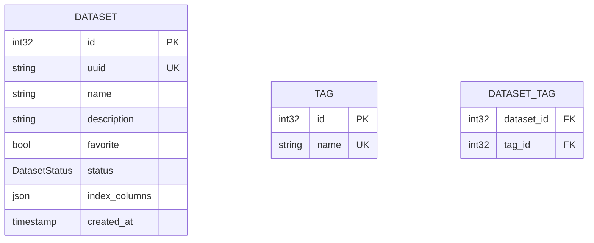
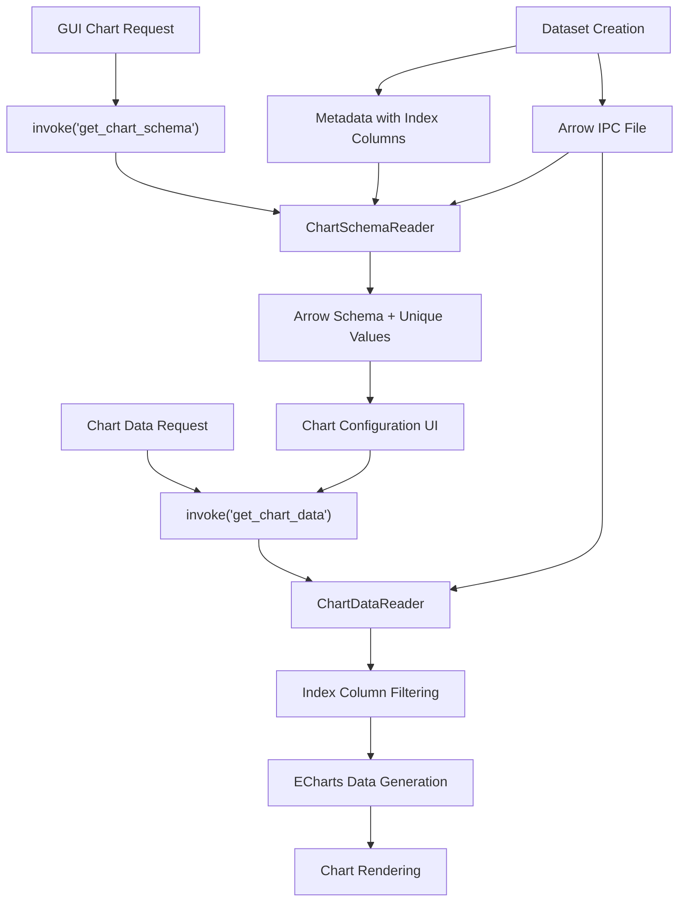

# Dataset Definition Enhancement for GUI Chart Functionality

## Overview

This design document analyzes the current dataset definition in fricon and proposes minimal enhancements to support parameter sweep visualization in the GUI. The focus is on enabling simple data slicing based on independent variable values from scientific experiments or parameter sweeps, following the KISS principle.

## Current Dataset Architecture Analysis

### Data Storage Model
fricon currently uses Apache Arrow IPC format with the following characteristics:
- **Storage Format**: Arrow IPC files (`dataset.arrow`) with immutable, append-only writes
- **Schema Definition**: Fixed schema at creation time with optional inference from first data write
- **Metadata Storage**: SQLite database + JSON files for dataset metadata
- **Data Structure**: Columnar storage with support for primitive types, lists, and complex structures

### Current Metadata Schema


### Current Data Access Limitations

**Issues Identified**:
1. **No Schema Access in GUI**: Arrow schema information is not exposed to the frontend
2. **No Data Content Reading**: GUI cannot read actual data values for chart generation
3. **Missing Index Column Semantics**: Index columns are stored but their role in parameter sweeps is not exposed
4. **No Simple Data Slicing**: No API to filter data by specific parameter values

## Chart Functionality Requirements

### Parameter Sweep Visualization Needs

**Primary Use Case**: Scientific experiments or simulations where users sweep multiple independent variables and want to visualize how dependent variables change.

**Chart Types to Support**:
- Line charts (parameter vs result)
- Scatter plots (correlation between variables)
- Multi-series plots (multiple parameters on same chart)

**Data Slicing Requirements**:
- **Parameter Selection**: Choose which independent variables to plot
- **Value Filtering**: Select specific values for swept parameters
- **Series Generation**: Create multiple series by varying one parameter while fixing others

### Simplified Chart Interface Requirements

```typescript
interface ChartDataRequest {
  datasetId: number;
  xColumn: string;                    // X-axis column (must be index column)
  yColumns: string[];                 // Y-axis columns (numeric dependent variables)
  indexColumnValues: IndexColumnValue[];  // Fixed values for other index columns
}

interface IndexColumnValue {
  column: string;                     // Index column name
  value: ColumnValue;                 // Specific value to filter by
}

// Enum supporting numeric, string, and boolean types
enum ColumnValue {
  Number(f64),
  String(String),
  Boolean(bool),
}

interface DatasetSchema {
  columns: ColumnInfo[];
  indexColumns: string[];             // Independent variables from metadata
}

interface ColumnInfo {
  name: string;
  dataType: ColumnDataType;           // Simplified data type enum
  isIndexColumn: boolean;             // Whether this is an independent variable
  uniqueValues?: ColumnValue[];       // Available values for index columns
}

enum ColumnDataType {
  Numeric,    // f64, i64, i32, etc.
  Text,       // String
  Boolean,    // bool
  Other,      // Unsupported for charting
}
```

## Proposed Dataset Definition Enhancements

### 1. Schema Access API

**Leverage existing Arrow schema from IPC file**:

```rust
// Minimal schema information for GUI
#[derive(Debug, Serialize, Deserialize)]
pub struct DatasetSchemaInfo {
    pub columns: Vec<ColumnInfo>,
    pub index_columns: Vec<String>,  // From existing metadata
    pub row_count: Option<u64>,
}

#[derive(Debug, Serialize, Deserialize)]
pub struct ColumnInfo {
    pub name: String,
    pub data_type: String,           // Arrow data type as string
    pub nullable: bool,
    pub is_index_column: bool,       // Whether this is an independent variable
}

// No additional metadata storage needed - read schema from Arrow file
// Only expose index_columns semantic meaning from existing metadata
```

### 2. No Database Schema Changes Needed

**Leverage existing schema**:
- Keep existing `index_columns` field in datasets table
- Read Arrow schema directly from IPC file when needed
- No additional metadata storage required
- Maintain current simple database structure

### 3. Simple Arrow Schema Reader

**Implement lightweight schema reading**:

```rust
pub struct DatasetSchemaReader {
    dataset_path: PathBuf,
}

impl DatasetSchemaReader {
    pub fn read_schema_info(&self, index_columns: &[String]) -> Result<DatasetSchemaInfo, ArrowError> {
        let file = File::open(self.dataset_path.join("dataset.arrow"))?;
        let reader = arrow::ipc::reader::FileReader::try_new(file, None)?;
        let schema = reader.schema();

        let columns = schema.fields().iter().map(|field| {
            ColumnInfo {
                name: field.name().clone(),
                data_type: format!("{:?}", field.data_type()),
                nullable: field.is_nullable(),
                is_index_column: index_columns.contains(field.name()),
            }
        }).collect();

        Ok(DatasetSchemaInfo {
            columns,
            index_columns: index_columns.to_vec(),
            row_count: Some(reader.num_batches() as u64), // Approximate
        })
    }
}
```

### 4. Tauri Commands for Chart Data API

**Add Tauri commands to existing command handlers**:

```rust
// In crates/fricon-ui/src/commands.rs

#[derive(Debug, Clone, serde::Serialize, serde::Deserialize)]
#[serde(tag = "type", content = "value")]
pub enum ColumnValue {
    Number(f64),
    String(String),
    Boolean(bool),
}

#[derive(Debug, serde::Serialize, serde::Deserialize)]
pub enum ColumnDataType {
    Numeric,
    Text,
    Boolean,
    Other,
}

#[derive(Debug, serde::Serialize, serde::Deserialize)]
pub struct ColumnInfo {
    pub name: String,
    pub data_type: ColumnDataType,
    pub is_index_column: bool,
    pub unique_values: Option<Vec<ColumnValue>>, // For index columns only
}

#[derive(Debug, serde::Serialize, serde::Deserialize)]
pub struct ChartSchemaResponse {
    pub columns: Vec<ColumnInfo>,
    pub index_columns: Vec<String>,
}

#[derive(Debug, serde::Serialize, serde::Deserialize)]
pub struct ChartDataRequest {
    pub dataset_id: i32,
    pub x_column: String,
    pub y_columns: Vec<String>,
    pub index_column_filters: Vec<IndexColumnFilter>,
}

#[derive(Debug, serde::Serialize, serde::Deserialize)]
pub struct IndexColumnFilter {
    pub column: String,
    pub value: ColumnValue,
}

// ECharts-optimized response format
#[derive(Debug, serde::Serialize, serde::Deserialize)]
pub struct EChartsDataResponse {
    pub dataset: EChartsDataset,
    pub series: Vec<EChartsSeries>,
}

#[derive(Debug, serde::Serialize, serde::Deserialize)]
pub struct EChartsDataset {
    pub dimensions: Vec<String>,
    pub source: Vec<Vec<ColumnValue>>,
}

#[derive(Debug, serde::Serialize, serde::Deserialize)]
pub struct EChartsSeries {
    pub name: String,
    pub r#type: String, // "line" or "scatter"
    pub data_group_id: usize,
}

// Tauri command handlers
#[tauri::command]
pub async fn get_chart_schema(
    app_handle: tauri::AppHandle,
    dataset_id: i32,
) -> Result<ChartSchemaResponse, String> {
    let app = get_app(&app_handle)?;
    let schema_reader = ChartSchemaReader::new(app);
    schema_reader.read_chart_schema(dataset_id)
        .await
        .map_err(|e| e.to_string())
}

#[tauri::command]
pub async fn get_chart_data(
    app_handle: tauri::AppHandle,
    request: ChartDataRequest,
) -> Result<EChartsDataResponse, String> {
    let app = get_app(&app_handle)?;
    let data_reader = ChartDataReader::new(app);
    data_reader.read_chart_data(request)
        .await
        .map_err(|e| e.to_string())
}
```

### 5. Chart Data Reader Implementation

**Implement chart data reading in the backend**:

```rust
// In crates/fricon/src/chart.rs (new module)

use std::fs::File;
use std::path::PathBuf;
use arrow::array::*;
use arrow::datatypes::DataType;
use arrow::ipc::reader::FileReader;
use arrow::record_batch::RecordBatch;
use anyhow::{Context, Result};

use crate::app::AppHandle;
use crate::dataset_manager::DatasetManager;

pub struct ChartSchemaReader {
    app: AppHandle,
}

impl ChartSchemaReader {
    pub fn new(app: AppHandle) -> Self {
        Self { app }
    }

    pub async fn read_chart_schema(&self, dataset_id: i32) -> Result<ChartSchemaResponse> {
        // Get dataset metadata for index columns
        let dataset = self.app.dataset_manager().get_dataset(dataset_id).await?;
        let dataset_path = self.app.workspace_paths().dataset_path_from_uuid(dataset.metadata.uuid);

        // Read Arrow schema from IPC file
        let arrow_file = dataset_path.join("dataset.arrow");
        let file = File::open(&arrow_file)
            .with_context(|| format!("Failed to open Arrow file: {:?}", arrow_file))?;

        let reader = FileReader::try_new(file, None)
            .context("Failed to create Arrow file reader")?;
        let schema = reader.schema();

        let mut columns = Vec::new();

        for field in schema.fields() {
            let data_type = self.classify_data_type(field.data_type());
            let is_index_column = dataset.metadata.index_columns.contains(field.name());

            let unique_values = if is_index_column {
                Some(self.extract_unique_values(&reader, field.name())?)
            } else {
                None
            };

            columns.push(ColumnInfo {
                name: field.name().clone(),
                data_type,
                is_index_column,
                unique_values,
            });
        }

        Ok(ChartSchemaResponse {
            columns,
            index_columns: dataset.metadata.index_columns,
        })
    }

    fn classify_data_type(&self, arrow_type: &DataType) -> ColumnDataType {
        match arrow_type {
            DataType::Int8 | DataType::Int16 | DataType::Int32 | DataType::Int64
            | DataType::UInt8 | DataType::UInt16 | DataType::UInt32 | DataType::UInt64
            | DataType::Float16 | DataType::Float32 | DataType::Float64 => ColumnDataType::Numeric,
            DataType::Utf8 | DataType::LargeUtf8 => ColumnDataType::Text,
            DataType::Boolean => ColumnDataType::Boolean,
            _ => ColumnDataType::Other,
        }
    }

    fn extract_unique_values(&self, reader: &FileReader, column_name: &str) -> Result<Vec<ColumnValue>> {
        // Extract unique values from the column for filtering UI
        // Implementation would iterate through batches and collect unique values
        // Limited to reasonable number (e.g., max 100 unique values)
        todo!("Extract unique values from Arrow column")
    }
}

pub struct ChartDataReader {
    app: AppHandle,
}

impl ChartDataReader {
    pub fn new(app: AppHandle) -> Self {
        Self { app }
    }

    pub async fn read_chart_data(&self, request: ChartDataRequest) -> Result<EChartsDataResponse> {
        let dataset = self.app.dataset_manager().get_dataset(request.dataset_id).await?;
        let dataset_path = self.app.workspace_paths().dataset_path_from_uuid(dataset.metadata.uuid);

        let arrow_file = dataset_path.join("dataset.arrow");
        let file = File::open(&arrow_file)?;
        let reader = FileReader::try_new(file, None)?;

        let mut chart_data = Vec::new();

        for batch_result in reader {
            let batch = batch_result?;
            let filtered_indices = self.apply_index_filters(&batch, &request.index_column_filters)?;

            for &row_idx in &filtered_indices {
                let mut row_values = Vec::new();

                // X-axis value
                let x_value = self.extract_value_at(&batch, &request.x_column, row_idx)?;
                row_values.push(x_value);

                // Y-axis values (numeric only)
                for y_column in &request.y_columns {
                    let y_value = self.extract_numeric_value_at(&batch, y_column, row_idx)?;
                    row_values.push(ColumnValue::Number(y_value));
                }

                chart_data.push(row_values);
            }
        }

        self.format_for_echarts(request, chart_data)
    }

    fn apply_index_filters(
        &self,
        batch: &RecordBatch,
        filters: &[IndexColumnFilter],
    ) -> Result<Vec<usize>> {
        // Implementation details for exact value filtering
        todo!("Apply index column filters")
    }

    fn extract_value_at(
        &self,
        batch: &RecordBatch,
        column: &str,
        row_idx: usize,
    ) -> Result<ColumnValue> {
        // Implementation details for value extraction
        todo!("Extract column value at index")
    }

    fn extract_numeric_value_at(
        &self,
        batch: &RecordBatch,
        column: &str,
        row_idx: usize,
    ) -> Result<f64> {
        // Implementation details for numeric value extraction
        todo!("Extract numeric value at index")
    }

    fn format_for_echarts(
        &self,
        request: ChartDataRequest,
        rows: Vec<Vec<ColumnValue>>,
    ) -> Result<EChartsDataResponse> {
        let mut dimensions = vec![request.x_column];
        dimensions.extend(request.y_columns.iter().cloned());

        let dataset = EChartsDataset {
            dimensions: dimensions.clone(),
            source: rows,
        };

        let series = request.y_columns
            .into_iter()
            .enumerate()
            .map(|(idx, name)| EChartsSeries {
                name,
                r#type: "line".to_string(),
                data_group_id: idx + 1, // +1 because 0 is X-axis
            })
            .collect();

        Ok(EChartsDataResponse { dataset, series })
    }
}
```

## Implementation Strategy

### Phase 1: Tauri Command Setup
1. **ColumnValue Enum**: Implement enum supporting numeric, string, boolean types with serde serialization
2. **Chart Module**: Create new chart.rs module in fricon crate for data reading logic
3. **Tauri Commands**: Add get_chart_schema and get_chart_data commands to fricon-ui
4. **Frontend Types**: Define TypeScript interfaces matching Rust serde structures

### Phase 2: Chart Data Implementation
1. **Schema Reader**: Implement Arrow schema reading and unique value extraction
2. **Data Reader**: Implement filtering by index column values with exact matches
3. **ECharts Format**: Generate ECharts dataset and series configuration directly
4. **Error Handling**: Use proper error handling following project standards

### Phase 3: Frontend Integration
1. **Chart Configuration UI**:
   - Use Tauri invoke() to call get_chart_schema
   - Dropdown to select X-axis column (from index columns)
   - Multi-select for Y-axis columns (numeric only)
   - Value selectors for other index columns using unique_values
2. **ECharts Integration**:
   - Call get_chart_data via Tauri invoke()
   - Use returned dataset/series directly in ECharts setOption()
3. **Reactive Updates**: Use Tauri events for real-time chart updates when data changes
4. **Performance**: Optimize for typical parameter sweep dataset sizes

## Data Flow Architecture



## Testing Strategy

### Unit Testing
- **ColumnValue Enum**: Test serde serialization/deserialization with TypeScript
- **Schema Classification**: Test Arrow data type to ColumnDataType conversion
- **Tauri Commands**: Test command handlers with mock AppHandle
- **Exact Filtering**: Test index column value matching with different data types
- **ECharts Format**: Test dataset and series generation for ECharts

### Integration Testing
- **End-to-End Charting**: Create parameter sweep → Tauri invoke → configure chart → render ECharts
- **Frontend-Backend Integration**: Test Tauri command calls from Vue.js frontend
- **Type Safety**: Test numeric-only validation for Y-axis columns
- **Multi-Y-axis**: Test multiple dependent variables in single chart
- **Event Handling**: Test Tauri events for real-time chart updates
- **Performance**: Test with typical scientific dataset sizes (thousands of data points)
