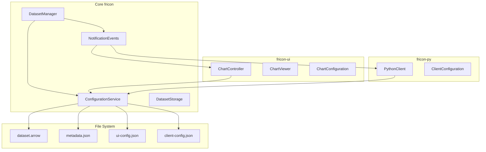
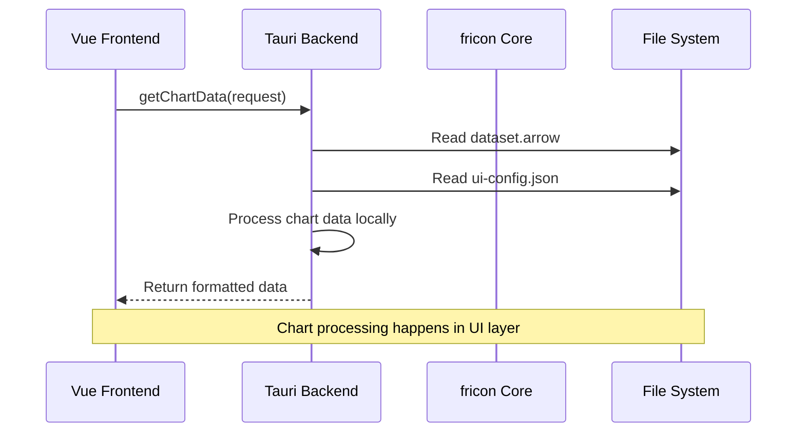
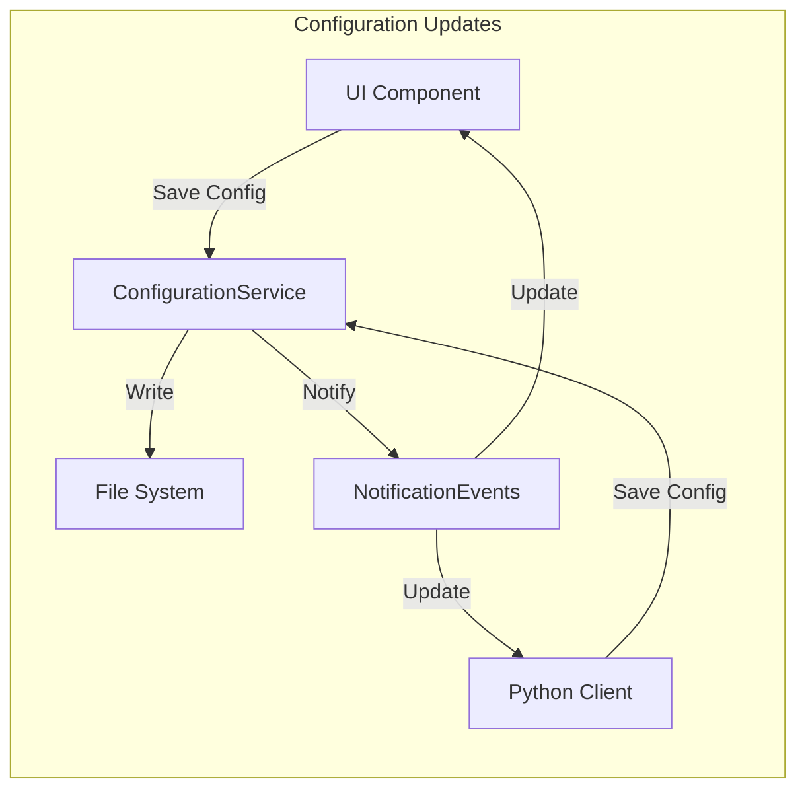
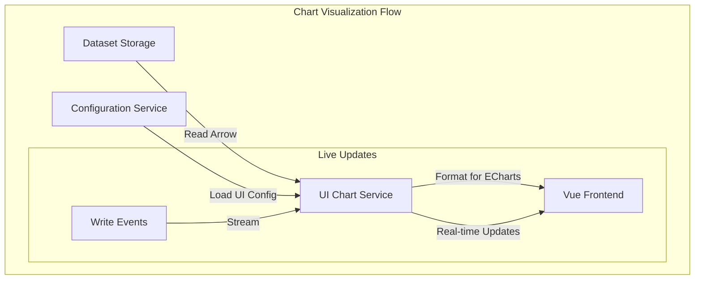

# Dataset JSON Configuration and Chart Migration Design

## Overview

This design outlines the enhancement of the dataset manager to support extensible JSON configuration storage and the migration of chart-specific functionality from the core fricon crate to fricon-ui. The goal is to provide a flexible configuration system that supports both fricon-ui chart configurations and future fricon-py client configurations, while maintaining clear architectural boundaries.

## Current Architecture Analysis

### Existing Chart Implementation in Core
- **ChartService**: Centralized service providing live plotting and chart data abstraction
- **ChartSchemaReader/ChartDataReader**: File-based chart data processing
- **ECharts Integration**: Optimized data formats for frontend visualization
- **Live Plotting**: Memory-based real-time chart updates for active datasets

### Current Dataset Structure
```
datasets/
├── <uuid_prefix>/
│   └── <full_uuid>/
│       ├── dataset.arrow      # Arrow IPC data file
│       └── metadata.json      # Dataset metadata (name, tags, etc.)
```

### Current Configuration Limitations
- Only dataset metadata is stored in `metadata.json`
- No support for UI-specific or client-specific configurations
- Chart functionality tightly coupled to core fricon crate

## Architecture Goals

### Separation of Concerns
- **Core fricon**: Generic configuration storage, data management, notification events
- **fricon-ui**: Chart-specific logic, visualization configurations, UI state
- **fricon-py**: Python client configurations (future)

### Configuration Storage Strategy
- Maintain existing `metadata.json` for core dataset metadata
- Add extensible JSON configuration files for component-specific settings
- Use file-based storage for persistence and cross-component sharing

## Component Architecture



## Configuration Service Design

### ConfigurationService API

```rust
// In fricon core
pub struct ConfigurationService {
    app: AppHandle,
}

impl ConfigurationService {
    // Generic configuration CRUD operations
    pub async fn save_config<T>(&self, dataset_id: i32, config_type: &str, config: &T) -> Result<()>
    where T: Serialize;

    pub async fn load_config<T>(&self, dataset_id: i32, config_type: &str) -> Result<Option<T>>
    where T: DeserializeOwned;

    pub async fn delete_config(&self, dataset_id: i32, config_type: &str) -> Result<()>;

    pub async fn list_config_types(&self, dataset_id: i32) -> Result<Vec<String>>;
}

// Configuration change notifications
#[derive(Debug, Clone, Serialize, Deserialize)]
pub enum ConfigurationEvent {
    ConfigSaved { dataset_id: i32, config_type: String },
    ConfigDeleted { dataset_id: i32, config_type: String },
}
```

### File Structure Enhancement

```
datasets/
├── <uuid_prefix>/
│   └── <full_uuid>/
│       ├── dataset.arrow           # Arrow IPC data file
│       ├── metadata.json           # Core dataset metadata
│       ├── ui-config.json          # UI-specific configurations
│       ├── client-config.json      # Python client configurations
│       └── custom-configs/         # Additional custom configurations
│           ├── chart-presets.json
│           └── analysis-params.json
```

### Configuration Types

#### Chart Configuration (UI-specific)
```typescript
interface ChartConfiguration {
    defaultVisualization: {
        chartType: 'line' | 'scatter' | 'bar' | 'heatmap';
        xAxis: string;
        yAxes: string[];
        indexFilters: IndexColumnFilter[];
    };
    savedViews: Array<{
        id: string;
        name: string;
        chartType: string;
        xAxis: string;
        yAxes: string[];
        indexFilters: IndexColumnFilter[];
    }>;
    displaySettings: {
        theme: 'light' | 'dark';
        gridLines: boolean;
        dataLabels: boolean;
    };
}
```

#### Client Configuration (Python-specific)
```json
{
    "defaultAnalysisParams": {
        "samplingRate": 1000,
        "indexColumns": ["timestamp", "experiment_id"]
    },
    "autoVisualization": {
        "enabled": true,
        "updateInterval": 5000
    },
    "exportSettings": {
        "defaultFormat": "parquet",
        "compression": "snappy"
    }
}
```

## Chart Functionality Migration

### Migration from Core to UI

#### Remove from fricon core:
- `ChartService` centralized chart service
- `ChartSchemaReader` and `ChartDataReader`
- ECharts-specific data formatting
- Chart-specific data structures

#### Move to fricon-ui:
- Chart data processing logic
- ECharts integration and optimization
- Chart configuration management
- Live plotting visualization updates

### Chart Data Access Pattern



### Live Plotting Migration

```rust
// In fricon-ui backend
pub struct UIChartService {
    dataset_subscriptions: HashMap<i32, DatasetEventSubscription>,
    live_data_cache: HashMap<i32, LiveDataBuffer>,
}

impl UIChartService {
    pub async fn subscribe_to_dataset(&mut self, dataset_id: i32) -> Result<()> {
        // Subscribe to dataset write events from core
        let subscription = core_app.subscribe_dataset_events(dataset_id).await?;
        self.dataset_subscriptions.insert(dataset_id, subscription);
        Ok(())
    }

    pub async fn process_live_update(&mut self, event: DatasetWriteEvent) -> Result<()> {
        // Process live data updates in UI layer
        if let Some(buffer) = self.live_data_cache.get_mut(&event.dataset_id) {
            buffer.add_batch(event.batch_data)?;
            self.notify_frontend_update(event.dataset_id).await?;
        }
        Ok(())
    }
}
```

## Data Flow Architecture

### Configuration Flow


### Chart Data Flow


## Implementation Phases

### Phase 1: Configuration Service Foundation
1. **ConfigurationService Implementation**
   - Generic JSON config save/load operations
   - File-based storage alongside dataset.arrow
   - Configuration change event system

2. **Dataset Manager Integration**
   - Add configuration service to AppHandle
   - Update dataset creation to initialize config directory
   - Maintain backward compatibility with existing metadata.json

### Phase 2: Chart Migration to UI
1. **UI Chart Service Creation**
   - Move chart data processing to fricon-ui Tauri backend
   - Implement local chart configuration management
   - Create live data subscription system

2. **Core Chart Service Removal**
   - Remove ChartService from core fricon
   - Update AppHandle to remove chart_service() method
   - Clean up chart-related dependencies

### Phase 3: Enhanced Configuration Features
1. **Chart Configuration UI**
   - Chart preset saving/loading interface
   - Visualization settings persistence
   - Cross-dataset configuration sharing

2. **Event-Driven Updates**
   - Real-time configuration synchronization
   - Multi-client configuration consistency
   - Conflict resolution strategies

## File System Operations

### Configuration File Management

```rust
// Configuration file naming convention
pub const CONFIG_FILE_PATTERN: &str = "{config_type}-config.json";

impl ConfigurationService {
    fn config_file_path(&self, dataset_uuid: Uuid, config_type: &str) -> PathBuf {
        let dataset_path = self.app.root().paths().dataset_path_from_uuid(dataset_uuid);
        dataset_path.join(format!("{}-config.json", config_type))
    }

    async fn ensure_config_directory(&self, dataset_uuid: Uuid) -> Result<()> {
        let dataset_path = self.app.root().paths().dataset_path_from_uuid(dataset_uuid);
        fs::create_dir_all(&dataset_path)?;
        Ok(())
    }
}
```

### Atomic Configuration Updates

```rust
impl ConfigurationService {
    async fn save_config_atomic<T>(&self, dataset_id: i32, config_type: &str, config: &T) -> Result<()>
    where T: Serialize {
        let record = self.app.dataset_manager().get_dataset(DatasetId::Id(dataset_id)).await?;
        let config_path = self.config_file_path(record.metadata.uuid, config_type);
        let temp_path = config_path.with_extension("json.tmp");

        // Write to temporary file first
        let file = File::create(&temp_path)?;
        let writer = BufWriter::new(file);
        serde_json::to_writer_pretty(writer, config)?;

        // Atomic rename
        fs::rename(&temp_path, &config_path)?;

        // Emit configuration change event
        self.app.send_event(AppEvent::ConfigurationChanged {
            dataset_id,
            config_type: config_type.to_string(),
        });

        Ok(())
    }
}
```

## Migration Strategy

### Backward Compatibility
- Existing chart functionality continues working during migration
- Gradual feature migration with feature flags
- Preserve existing API contracts during transition

### Rollback Plan
- Keep original chart implementation as fallback
- Configuration service can be disabled via feature flag
- File-based configs are non-destructive additions

### Testing Strategy
- Unit tests for configuration service CRUD operations
- Integration tests for chart migration
- Performance tests for live data handling in UI layer
- End-to-end tests for configuration persistence

## Security Considerations

### File System Security
- Configuration files inherit dataset directory permissions
- No sensitive data in configuration files
- Atomic operations prevent partial writes

### Data Validation
- JSON schema validation for configuration types
- Size limits on configuration files
- Sanitization of user-provided configuration data

## Performance Implications

### Configuration Access
- In-memory caching for frequently accessed configs
- Lazy loading of configuration data
- Batch configuration operations where possible

### Chart Data Processing
- Move processing closer to visualization layer
- Reduce data serialization between core and UI
- Optimize Arrow data reading in UI layer

## Error Handling

### Configuration Errors
```rust
#[derive(Debug, thiserror::Error)]
pub enum ConfigurationError {
    #[error("Configuration type '{config_type}' not found for dataset {dataset_id}")]
    ConfigNotFound { dataset_id: i32, config_type: String },

    #[error("Invalid configuration format: {message}")]
    InvalidFormat { message: String },

    #[error("Configuration file size exceeds limit")]
    SizeExceeded,

    #[error("IO error: {0}")]
    Io(#[from] std::io::Error),
}
```

### Migration Error Handling
- Graceful fallback to core chart service if UI migration fails
- Configuration corruption recovery mechanisms
- Clear error messages for configuration validation failures
