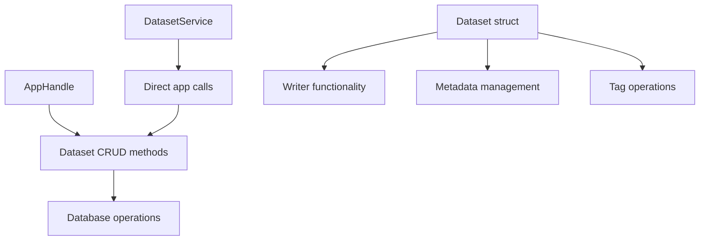
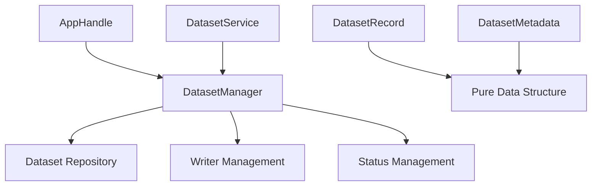
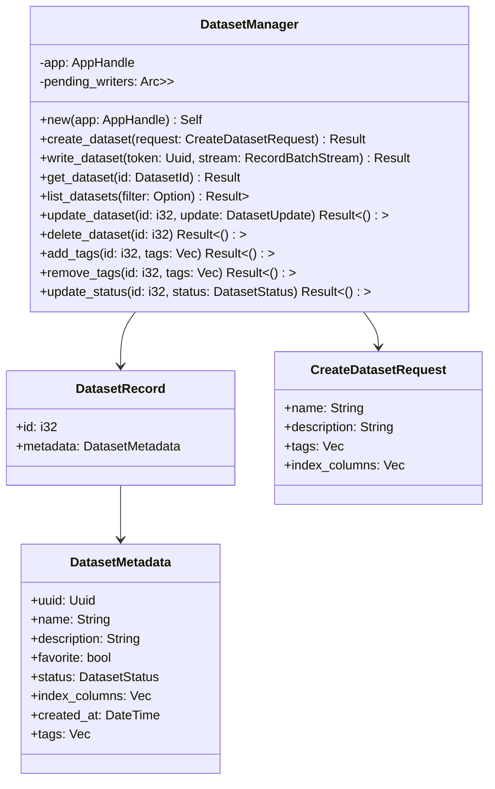
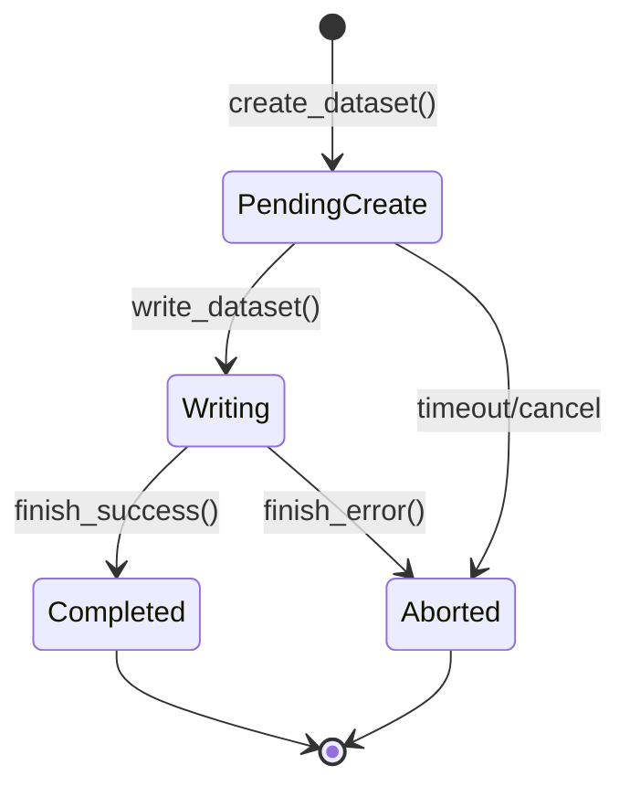
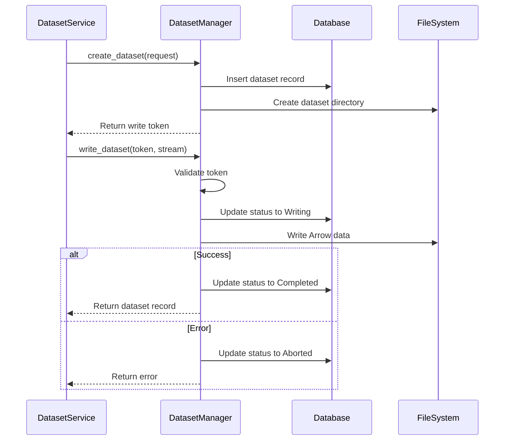
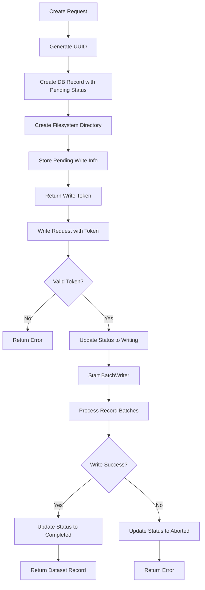

# Dataset Manager Refactor Design

## Overview

The current dataset interaction logic is scattered across multiple files (`app.rs`, `dataset.rs`, and `server/dataset.rs`), creating tight coupling and making the codebase difficult to maintain. This refactor centralizes all server-side dataset operations into a dedicated `DatasetManager` that provides a clean interface for CRUD operations and dataset lifecycle management.

## Technology Stack & Dependencies

- **Core**: Rust with Diesel ORM
- **Database**: SQLite with connection pooling (deadpool-diesel)
- **Data Format**: Apache Arrow for dataset storage
- **IPC**: Protocol Buffers (protobuf) for gRPC communication
- **Async Runtime**: Tokio for async operations

## Architecture

### Current State Analysis

The existing architecture has dataset logic distributed across three main areas:



**Problems with Current Design:**
- Dataset logic scattered across multiple modules
- `Dataset` struct handles both data representation and business logic
- `AppHandle` contains dataset-specific methods that could be abstracted
- `DatasetService` directly calls app methods, creating tight coupling
- Inconsistent error handling and status updates across different operations

### Target Architecture

The refactored architecture centralizes dataset operations in a dedicated manager:



## Component Architecture

### DatasetManager

The `DatasetManager` serves as the central hub for all dataset operations:



### DatasetWriter Management

The writer functionality is extracted and managed by the `DatasetManager`:



### Data Flow Architecture



## API Endpoints Reference

### DatasetManager Methods

#### Dataset Creation
```rust
pub async fn create_dataset(
    &self,
    request: CreateDatasetRequest
) -> Result<Uuid> {
    // Generate UUID for dataset
    // Create database record with Pending status
    // Create filesystem directory
    // Store pending write information
    // Return write token
}
```

#### Dataset Writing
```rust
pub async fn write_dataset(
    &self,
    token: Uuid,
    stream: impl Stream<Item = Result<RecordBatch>>
) -> Result<DatasetRecord> {
    // Validate write token
    // Update status to Writing
    // Create and manage BatchWriter
    // Handle write completion or failure
    // Update final status
    // Return dataset record
}
```

#### Dataset Retrieval
```rust
pub async fn get_dataset(&self, id: DatasetId) -> Result<DatasetRecord>
pub async fn get_dataset_by_uuid(&self, uuid: Uuid) -> Result<DatasetRecord>
pub async fn list_datasets(&self, filter: Option<DatasetFilter>) -> Result<Vec<DatasetRecord>>
```

#### Dataset Modification
```rust
pub async fn update_dataset(&self, id: i32, update: DatasetUpdate) -> Result<()>
pub async fn add_tags(&self, id: i32, tags: Vec<String>) -> Result<()>
pub async fn remove_tags(&self, id: i32, tags: Vec<String>) -> Result<()>
pub async fn delete_dataset(&self, id: i32) -> Result<()>
```

## Data Models & ORM Mapping

### Core Data Structures

```rust
// Pure data structures without business logic
#[derive(Debug, Clone)]
pub struct DatasetRecord {
    pub id: i32,
    pub metadata: DatasetMetadata,
}

#[derive(Debug, Clone, Serialize, Deserialize)]
pub struct DatasetMetadata {
    pub uuid: Uuid,
    pub name: String,
    pub description: String,
    pub favorite: bool,
    pub status: DatasetStatus,
    pub index_columns: Vec<String>,
    pub created_at: DateTime<Utc>,
    pub tags: Vec<String>,
}

#[derive(Debug)]
pub struct CreateDatasetRequest {
    pub name: String,
    pub description: String,
    pub tags: Vec<String>,
    pub index_columns: Vec<String>,
}

#[derive(Debug)]
pub enum DatasetId {
    Id(i32),
    Uuid(Uuid),
}
```

### Database Integration

The `DatasetManager` interacts with the database through the existing Diesel models but abstracts the complexity:

```rust
impl DatasetManager {
    async fn create_db_record(&self, request: &CreateDatasetRequest, uuid: Uuid) -> Result<database::Dataset> {
        self.app.database().interact(move |conn| {
            conn.immediate_transaction(|conn| {
                let new_dataset = NewDataset {
                    uuid: SimpleUuid(uuid),
                    name: &request.name,
                    description: &request.description,
                    status: DatasetStatus::Pending,
                    index_columns: JsonValue(&request.index_columns),
                };

                let dataset = diesel::insert_into(schema::datasets::table)
                    .values(new_dataset)
                    .returning(database::Dataset::as_returning())
                    .get_result(conn)?;

                // Handle tags creation and association
                self.associate_tags(conn, dataset.id, &request.tags)?;

                Ok(dataset)
            })
        }).await
    }
}
```

## Business Logic Layer

### Dataset Lifecycle Management



### Error Handling Strategy

```rust
#[derive(Debug, thiserror::Error)]
pub enum DatasetManagerError {
    #[error("Dataset not found: {id}")]
    NotFound { id: String },

    #[error("Invalid write token")]
    InvalidToken,

    #[error("Dataset is not in writable state: {status:?}")]
    NotWritable { status: DatasetStatus },

    #[error("Schema validation failed: {message}")]
    SchemaError { message: String },

    #[error("Database error: {source}")]
    Database { #[from] source: anyhow::Error },

    #[error("IO error: {source}")]
    Io { #[from] source: std::io::Error },
}
```

### Tag Management

```rust
impl DatasetManager {
    async fn associate_tags(&self, conn: &mut SqliteConnection, dataset_id: i32, tags: &[String]) -> Result<()> {
        // Insert or ignore new tags
        let new_tags: Vec<_> = tags.iter().map(|name| NewTag { name }).collect();
        diesel::insert_or_ignore_into(schema::tags::table)
            .values(new_tags)
            .execute(conn)?;

        // Get tag IDs and create associations
        let tag_ids = schema::tags::table
            .filter(schema::tags::name.eq_any(tags))
            .select(schema::tags::id)
            .load::<i32>(conn)?;

        let dataset_tags: Vec<_> = tag_ids
            .into_iter()
            .map(|tag_id| DatasetTag { dataset_id, tag_id })
            .collect();

        diesel::insert_or_ignore_into(schema::datasets_tags::table)
            .values(dataset_tags)
            .execute(conn)?;

        Ok(())
    }
}
```

## Testing Strategy

### Unit Testing Approach

```rust
#[cfg(test)]
mod tests {
    use super::*;
    use crate::test_utils::*;

    #[tokio::test]
    async fn test_create_dataset() {
        let manager = setup_test_manager().await;

        let request = CreateDatasetRequest {
            name: "test_dataset".to_string(),
            description: "Test description".to_string(),
            tags: vec!["tag1".to_string(), "tag2".to_string()],
            index_columns: vec!["col1".to_string()],
        };

        let token = manager.create_dataset(request).await.unwrap();
        assert!(token != Uuid::nil());
    }

    #[tokio::test]
    async fn test_dataset_lifecycle() {
        let manager = setup_test_manager().await;

        // Create dataset
        let token = manager.create_dataset(test_request()).await.unwrap();

        // Write data
        let batches = create_test_batches();
        let record = manager.write_dataset(token, stream::iter(batches.into_iter().map(Ok))).await.unwrap();

        // Verify status
        assert_eq!(record.metadata.status, DatasetStatus::Completed);

        // Retrieve dataset
        let retrieved = manager.get_dataset(DatasetId::Id(record.id)).await.unwrap();
        assert_eq!(retrieved.id, record.id);
    }
}
```

### Integration Testing

```rust
#[tokio::test]
async fn test_dataset_service_integration() {
    let app_manager = AppManager::serve(test_workspace_path()).await.unwrap();
    let service = DatasetService::new(app_manager.handle().clone());

    // Test create -> write -> get workflow
    let create_response = service.create(Request::new(create_request())).await.unwrap();
    let write_response = service.write(Request::new(write_stream())).await.unwrap();
    let get_response = service.get(Request::new(get_request())).await.unwrap();

    assert!(get_response.into_inner().dataset.is_some());
}
```

## Implementation Plan

### Phase 1: Extract DatasetManager Interface
1. Create `DatasetManager` struct with basic CRUD operations
2. Move dataset creation logic from `AppHandle` to `DatasetManager`
3. Implement dataset retrieval and listing methods
4. Add comprehensive error handling

### Phase 2: Refactor DatasetService
1. Update `DatasetService` to use `DatasetManager` instead of direct `AppHandle` calls
2. Simplify service implementation by delegating to manager
3. Remove dataset-specific logic from service layer
4. Update protobuf conversions

### Phase 3: Simplify Dataset Structure
1. Convert `Dataset` struct to pure data structure (`DatasetRecord`)
2. Remove business logic methods from `Dataset`
3. Move writer management to `DatasetManager`
4. Update all references to use new structure

### Phase 4: Testing and Validation
1. Add comprehensive unit tests for `DatasetManager`
2. Create integration tests for service layer
3. Validate performance with existing benchmarks
4. Ensure backward compatibility

### Migration Strategy

```rust
// During transition period, maintain compatibility
impl AppHandle {
    #[deprecated(note = "Use DatasetManager::create_dataset instead")]
    pub async fn create_dataset(&self, name: String, description: String, tags: Vec<String>, index_columns: Vec<String>) -> Result<dataset::Writer> {
        let manager = DatasetManager::new(self.clone());
        let request = CreateDatasetRequest { name, description, tags, index_columns };
        let token = manager.create_dataset(request).await?;

        // Create compatible Writer wrapper
        Ok(LegacyWriter::new(manager, token))
    }
}
```
