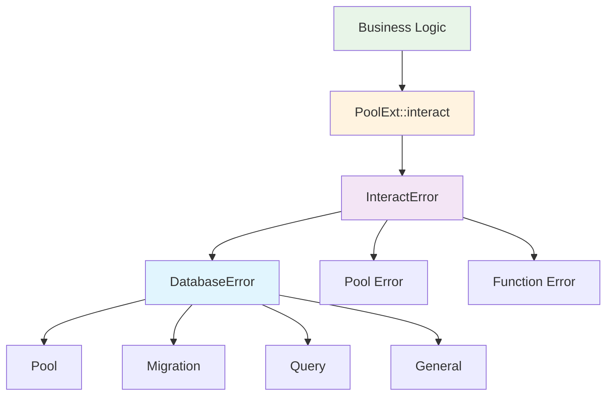

# Database Module Error Handling Enhancement Design

## Overview

This design document outlines the enhancement of error handling in the fricon database module (`crates/fricon/src/database.rs`) to provide better error management for business logic while maintaining simplicity during the project's early development phase.

The current database module uses generic `anyhow::Result` types which makes error handling difficult for business logic layers. This enhancement introduces dedicated error types using `thiserror` directly within the database module, providing maximum flexibility for the `interact` method while avoiding over-granular error categorization.

## Architecture

### Current State Analysis

The current database module exhibits several error handling challenges:

1. **Generic Error Types**: The `PoolExt::interact` method requires functions to return `anyhow::Result<T>`, making it difficult for business logic to handle specific database errors
2. **Limited Error Context**: Database-specific errors are wrapped in generic `anyhow::Error` types
3. **Poor Error Propagation**: Business logic cannot differentiate between different types of database failures

### Enhanced Error Type Hierarchy



### Error Type Definitions (in database.rs)

#### DatabaseError

The core error type for all database operations, defined directly in `database.rs`:

```rust
#[derive(Debug, thiserror::Error)]
pub enum DatabaseError {
    #[error("Database pool error: {message}")]
    Pool {
        message: String,
        #[source]
        source: deadpool_diesel::PoolError
    },

    #[error("Database migration error: {message}")]
    Migration {
        message: String,
        #[source]
        source: Box<dyn std::error::Error + Send + Sync>
    },

    #[error("Database query error: {message}")]
    Query {
        message: String,
        #[source]
        source: diesel::result::Error
    },

    #[error("Database operation error: {message}")]
    General {
        message: String,
        #[source]
        source: anyhow::Error
    },
}
```

#### InteractError

Specialized error type for the enhanced `PoolExt::interact` method, also defined in `database.rs`:

```rust
#[derive(Debug, thiserror::Error)]
pub enum InteractError {
    #[error("Database pool interaction failed")]
    Pool {
        #[from]
        source: deadpool_diesel::InteractError,
    },

    #[error("Database function execution failed: {message}")]
    Function {
        message: String,
    },
}
```

### Enhanced PoolExt Trait

The enhanced trait provides maximum flexibility by allowing the function to return any type `R`:

```rust
pub trait PoolExt {
    /// Generic interact method with maximum flexibility
    /// Function F can return any type R, providing complete freedom
    async fn interact<F, R>(&self, f: F) -> Result<R, InteractError>
    where
        F: FnOnce(&mut SqliteConnection) -> R + Send + 'static,
        R: Send + 'static;
}
```

## Implementation Strategy

### Error Type Conversion Patterns

#### From Diesel QueryResult

```rust
impl<T> From<diesel::result::Error> for DatabaseError {
    fn from(source: diesel::result::Error) -> Self {
        Self::Query {
            message: "Database query failed".to_string(),
            source,
        }
    }
}
```

#### From InteractError to DatabaseError

```rust
impl From<InteractError> for DatabaseError {
    fn from(error: InteractError) -> Self {
        match error {
            InteractError::Pool { source } => Self::General {
                message: "Pool interaction failed".to_string(),
                source: anyhow::Error::new(source),
            },
            InteractError::Function { message } => Self::General {
                message,
                source: anyhow::Error::msg("Function execution failed"),
            },
        }
    }
}
```

### Enhanced Database Module Interface

#### Connection Management

```rust
pub async fn connect(
    path: impl AsRef<Path>,
    backup_path: impl Into<PathBuf>
) -> Result<Pool, DatabaseError> {
    // Enhanced connection with specific error handling
}
```

#### Pool Extension Implementation

```rust
impl PoolExt for Pool {
    async fn interact<F, R>(&self, f: F) -> Result<R, InteractError>
    where
        F: FnOnce(&mut SqliteConnection) -> R + Send + 'static,
        R: Send + 'static,
    {
        let conn = self.get().await.map_err(|e| InteractError::Pool {
            source: deadpool_diesel::InteractError::from(e)
        })?;

        conn.interact(f)
            .await
            .map_err(InteractError::Pool)
    }
}
```

## Usage Patterns

### Business Logic Integration

#### DatasetManager Error Handling

```rust
impl DatasetManager {
    pub async fn create_dataset(&self, request: CreateDatasetRequest) -> Result<i32, DatasetManagerError> {
        let dataset_id = self
            .app
            .database()
            .interact(|conn| {
                // Function can return any type - diesel::QueryResult<i32> in this case
                let dataset = NewDataset { /* ... */ };
                diesel::insert_into(schema::datasets::table)
                    .values(dataset)
                    .returning(schema::datasets::id)
                    .get_result::<i32>(conn)
            })
            .await
            .map_err(|interact_err| {
                // Convert InteractError to DatasetManagerError
                DatasetManagerError::Database {
                    source: anyhow::Error::new(interact_err)
                }
            })?;

        // Handle the diesel::QueryResult<i32>
        dataset_id.map_err(|diesel_err| {
            DatasetManagerError::Database {
                source: anyhow::Error::new(diesel_err)
            }
        })
    }

    // Alternative: Handle errors within the closure
    pub async fn create_dataset_alt(&self, request: CreateDatasetRequest) -> Result<i32, DatasetManagerError> {
        self.app
            .database()
            .interact(|conn| {
                let dataset = NewDataset { /* ... */ };
                diesel::insert_into(schema::datasets::table)
                    .values(dataset)
                    .returning(schema::datasets::id)
                    .get_result::<i32>(conn)
                    .map_err(|e| DatasetManagerError::Database {
                        source: anyhow::Error::new(e)
                    })
            })
            .await
            .map_err(|interact_err| {
                DatasetManagerError::Database {
                    source: anyhow::Error::new(interact_err)
                }
            })
            .flatten() // Flatten Result<Result<T, E>, F> to Result<T, E>
    }
}
```

#### Simplified Error Conversion

```rust
// Using From trait for cleaner code
impl From<InteractError> for DatasetManagerError {
    fn from(error: InteractError) -> Self {
        Self::Database {
            source: anyhow::Error::new(error)
        }
    }
}
```

### Migration and Connection Error Handling

#### Enhanced Migration Management

```rust
fn run_migrations(conn: &mut SqliteConnection, backup_path: &Path) -> Result<(), DatabaseError> {
    let applied_migrations = conn
        .applied_migrations()
        .map_err(|e| DatabaseError::Migration {
            message: "Failed to get applied migrations".to_string(),
            source: e.into(),
        })?;

    // Rest of migration logic with proper error conversion
}
```

## Type Safety and Conversion Guidelines

### Database Status Handling

The existing `DatasetStatus` enum provides good type safety and should be maintained with the Copy trait for performance:

```rust
#[derive(Debug, Clone, Copy, PartialEq, Eq, Serialize, Deserialize, FromSqlRow, AsExpression)]
#[diesel(sql_type = Text)]
pub enum DatasetStatus {
    Pending,
    Writing,
    Completed,
    Aborted,
}
```

### Error Helper Methods

```rust
impl DatabaseError {
    /// Create a database error from a diesel error with context
    pub fn query_error(message: impl Into<String>, source: diesel::result::Error) -> Self {
        Self::Query {
            message: message.into(),
            source,
        }
    }

    /// Create a database error from a pool error with context
    pub fn pool_error(message: impl Into<String>, source: deadpool_diesel::PoolError) -> Self {
        Self::Pool {
            message: message.into(),
            source,
        }
    }

    /// Create a general database error from any error
    pub fn general_error(message: impl Into<String>, source: impl Into<anyhow::Error>) -> Self {
        Self::General {
            message: message.into(),
            source: source.into(),
        }
    }
}
```

## Testing Strategy

### Unit Testing Database Errors

```rust
#[cfg(test)]
mod tests {
    use super::*;

    #[tokio::test]
    async fn test_interact_with_diesel_error() {
        let pool = setup_test_pool().await;

        let result: Result<i32, InteractError> = pool.interact(|conn| {
            // Return diesel::QueryResult directly
            Err::<i32, diesel::result::Error>(diesel::result::Error::NotFound)
        }).await;

        // The function returns diesel::QueryResult, interact returns InteractError
        assert!(result.is_ok()); // interact itself succeeded

        // The actual diesel error is in the returned value
        if let Ok(diesel_result) = result {
            assert!(matches!(diesel_result, Err(diesel::result::Error::NotFound)));
        }
    }

    #[tokio::test]
    async fn test_interact_with_generic_return() {
        let pool = setup_test_pool().await;

        // Test with custom return type
        let result: Result<String, InteractError> = pool.interact(|_conn| {
            "success".to_string()
        }).await;

        assert_eq!(result.unwrap(), "success");
    }

    #[test]
    fn test_database_error_conversion() {
        let diesel_error = diesel::result::Error::NotFound;
        let db_error: DatabaseError = diesel_error.into();

        match db_error {
            DatabaseError::Query { source, .. } => {
                assert!(matches!(source, diesel::result::Error::NotFound));
            }
            _ => panic!("Expected DatabaseError::Query"),
        }
    }
}
```

## Migration Strategy

### Phase 1: Error Type Introduction

1. Add `DatabaseError` and `InteractError` types directly to `database.rs`
2. Implement conversion traits (`From`, `Into`)
3. Add helper methods for error creation

### Phase 2: Enhanced PoolExt Implementation

1. Replace existing `interact` method with new generic implementation
2. Update all internal usage to work with new signature
3. No backward compatibility needed - internal module only

### Phase 3: Business Logic Integration

1. Update `DatasetManager` and other consumers to handle new return patterns
2. Implement error handling patterns for generic return types
3. Add comprehensive error conversion support

### Phase 4: Validation and Testing

1. Comprehensive testing of error handling paths
2. Performance validation
3. Documentation updates
4. Ensure all usage patterns work correctly

## Performance Considerations

### Memory Efficiency

- Error types use `Box<dyn Error>` for large error chains to minimize stack usage
- `Copy` trait on `DatasetStatus` for efficient value passing
- Avoid unnecessary string allocations in error messages

### Error Propagation Cost

- Minimal overhead for error conversion using `From` traits
- Zero-cost abstractions where possible
- Efficient error context preservation

## Security and Safety

### Error Information Disclosure

- Avoid exposing internal database structure in error messages
- Sanitize user input in error contexts
- Maintain audit trail for database errors

### Memory Safety

- All error types implement appropriate bounds (`Send + Sync + 'static`)
- Proper lifetime management for error sources
- No unsafe code in error handling paths
